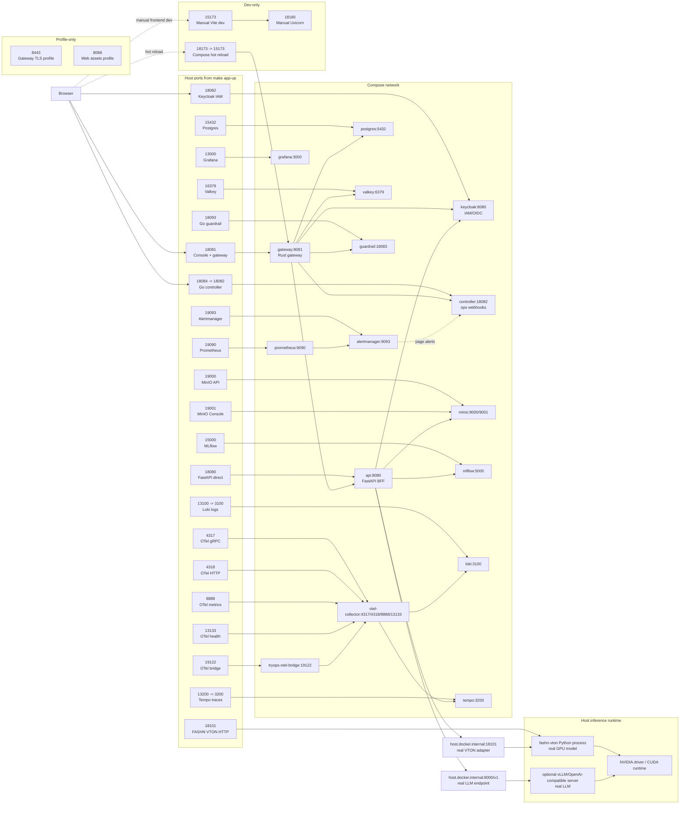

# TryOps Ports

These are the ports used by `make app-up`. They are not always the same as the raw `docker-compose.yml` defaults because the Makefile injects local-friendly host ports.

## Port Relationship Chart



## `make app-up` Ports

| Service | Default URL or port | Override variable | Notes |
| --- | --- | --- | --- |
| TryOps Console + Rust gateway | `http://127.0.0.1:18081` | `TRYOPS_GATEWAY_PORT` | Main app URL. Use this first. |
| FastAPI backend direct | `http://127.0.0.1:18080` | `TRYOPS_API_PORT` | Direct API/docs access. Gateway normally proxies this. |
| Keycloak IAM | `http://127.0.0.1:18082` | `TRYOPS_KEYCLOAK_PORT` | OIDC/IAM service. Container port is `8080`. |
| Go controller | `http://127.0.0.1:18084` | `TRYOPS_CONTROLLER_PORT` | Webhook/control-plane service. Container port is `18082`; Alertmanager uses `http://controller:18082/alerts/webhook` inside Compose. |
| FASHN VTON HTTP | `http://127.0.0.1:18101` | `FASHN_VTON_PORT` | Host-side real VTON model service started by `make app-up` before Compose. This is not a Docker Compose container. API reaches it from inside Docker through `host.docker.internal:18101`. |
| Postgres | `127.0.0.1:15432` | `TRYOPS_POSTGRES_PORT` | Database for the full Compose stack. |
| Valkey | `127.0.0.1:16379` | `TRYOPS_VALKEY_PORT` | Hot quota/rate counter store. |
| MinIO API | `http://127.0.0.1:19000` | `TRYOPS_MINIO_PORT` | Object/artifact storage API. |
| MinIO Console | `http://127.0.0.1:19001` | `TRYOPS_MINIO_CONSOLE_PORT` | Browser UI for MinIO. |
| MLflow | `http://127.0.0.1:15000` | `TRYOPS_MLFLOW_PORT` | Experiment/model tracking. |
| Prometheus | `http://127.0.0.1:19090` | `TRYOPS_PROMETHEUS_PORT` | Metrics database. |
| Alertmanager | `http://127.0.0.1:19093` | `TRYOPS_ALERTMANAGER_PORT` | Alert routing. |
| Grafana | `http://127.0.0.1:13000` | `TRYOPS_GRAFANA_PORT` | Dashboards. Grafana defaults to `admin` / `admin` on a fresh local volume. |
| Loki | `http://127.0.0.1:13100` | `TRYOPS_LOKI_PORT` | Log store used by Grafana when `TRYOPS_OBSERVABILITY` is enabled. Container port is `3100`. |
| Tempo | `http://127.0.0.1:13200` | `TRYOPS_TEMPO_PORT` | Trace store used by Grafana when `TRYOPS_OBSERVABILITY` is enabled. Container port is `3200`. |
| Go guardrail sidecar | `127.0.0.1:18093` | `TRYOPS_GUARDRAIL_PORT` | LLM guardrail service. Usually called by gateway/API. Container port is `18083`. |
| OpenTelemetry gRPC | `127.0.0.1:4317` | `TRYOPS_OTEL_GRPC_PORT` | OTLP gRPC receiver. |
| OpenTelemetry HTTP | `127.0.0.1:4318` | `TRYOPS_OTEL_HTTP_PORT` | OTLP HTTP receiver. |
| OpenTelemetry metrics | `127.0.0.1:8888` | `TRYOPS_OTEL_METRICS_PORT` | Collector metrics endpoint. |
| OpenTelemetry health | `127.0.0.1:13133` | `TRYOPS_OTEL_HEALTH_PORT` | Collector health endpoint. |
| OTel bridge metrics | `http://127.0.0.1:19122/metrics` | `TRYOPS_OTEL_BRIDGE_PORT` | Bridges local TryOps JSONL logs/traces into OTLP for Grafana/Loki/Tempo. |

`make app-up` starts:

```text
FASHN VTON local service, gateway, keycloak, controller, api, postgres, valkey,
prometheus, alertmanager, otel-collector, grafana, loki, tempo, tryops-otel-bridge,
minio, mlflow, guardrail
```

It does not start the Vite dev server unless `TRYOPS_HOT_RELOAD=1` is set.
It starts Loki, Tempo, and the OTel bridge unless `TRYOPS_OBSERVABILITY=0` is set.

## Inference Runtime Boundary

The FASHN VTON model is intentionally outside the Compose network in the current local stack:

- `make app-up` starts `scripts/serve_fashn_vton.py` as a host Python process.
- Its PID is tracked in `artifacts/runtime/fashn-vton-service.pid`.
- Raw stdout/stderr goes to `artifacts/logs/fashn-vton-service.log`.
- Structured model-service events go to `artifacts/logs/fashn_vton_events.jsonl` and are ingested into Loki when observability is enabled.
- The API container calls it through `TRYOPS_REAL_VTON_URL`, which defaults to `http://host.docker.internal:18101`.

This means container-only monitoring does not show the full inference picture. `docker stats` can show API, gateway, Grafana, Loki, and other containers, but it will not show the real FASHN GPU process CPU/RSS or GPU memory usage because that process runs on the host.

For the current local stack, check the model process directly:

```bash
cat artifacts/runtime/fashn-vton-service.pid
ps -p "$(cat artifacts/runtime/fashn-vton-service.pid)" -o pid,pcpu,pmem,rss,vsz,etime,cmd
nvidia-smi
nvidia-smi pmon -s um
```

## Recommended Production Design

Best production design is to keep model inference behind a separate model-serving boundary, not inside the FastAPI BFF and not as an untracked shell process.

For a single GPU workstation or bare-metal server:

- Run FASHN as a supervised service, for example `systemd`, Nomad, or a GPU-enabled container managed by NVIDIA Container Toolkit.
- Bind the model HTTP endpoint to loopback or a private interface.
- Keep `TRYOPS_REAL_VTON_URL` pointed at that endpoint.
- Expose `/health` and `/metrics` from the model service.
- Scrape host and GPU telemetry with Prometheus exporters.
- Keep raw backend logs in Grafana/Loki and show only sanitized job status, `job_id`, `request_id`, and user-safe errors in the product UI.

For a multi-node production deployment:

- Put VTON behind a real model-serving platform such as KServe, Triton Inference Server, Ray Serve, or a dedicated GPU deployment.
- Replace `host.docker.internal` with service DNS, for example `http://fashn-vton.tryops-serving.svc.cluster.local`.
- Use readiness gates that prove the real model and CUDA runtime are loaded before accepting user jobs.
- Scrape GPU nodes with DCGM exporter and scrape hosts with node exporter.
- Alert on GPU saturation, VRAM pressure, model-service failures, queue age, and stale running jobs.

Recommended hardware telemetry exporters:

| Exporter | Default port | What it covers | Production status |
| --- | --- | --- | --- |
| NVIDIA DCGM exporter | `9400` | GPU utilization, VRAM, power, temperature, XID errors | Recommended for any NVIDIA inference host. |
| node exporter | `9100` | Host CPU, RAM, disk, network, filesystem pressure | Recommended for every inference host. |
| process exporter | `9256` | Per-process CPU/RSS for `fashn-vton` and optional vLLM | Recommended while FASHN is host-side. |
| cAdvisor | `8080` by default, choose a non-conflicting host port | Container CPU/RAM/network/disk by container | Useful for Compose/Kubernetes containers, but not enough for host-side FASHN. |

These hardware exporters are not currently part of `make app-up`. Until they are wired into Compose or host services, Grafana can show TryOps app/log behavior but cannot fully show device-level inference utilization.

## Development-Only Ports

| Service | Default URL or port | Override variable | Notes |
| --- | --- | --- | --- |
| Manual FastAPI dev | `http://127.0.0.1:18180` | `--port` in the `uvicorn` command | Used when running FastAPI manually for frontend development. |
| Vite frontend dev | `http://127.0.0.1:15173` | Vite may auto-pick another port if busy | Started by `npm --prefix web run dev`; not started by `make app-up`. |
| Compose hot-reload UI | `http://127.0.0.1:18173` | `TRYOPS_WEB_DEV_PORT` | Started by `make app-up-hotreload` or `make app-dev`; maps host `18173` to container Vite port `15173`. |

Frontend dev command:

```bash
VITE_TRYOPS_API_BASE=http://127.0.0.1:18180 npm --prefix web run dev
```

## Profile-Only Ports

These services are defined in Compose but are not part of the default `make app-up` service list.

| Service | Default URL or port | Override variable | Profile | Notes |
| --- | --- | --- | --- | --- |
| Web assets server | `http://127.0.0.1:8088` | `TRYOPS_WEB_ASSETS_PORT` | `assets` | Static web-assets profile. |
| Gateway TLS | `https://127.0.0.1:8443` | `TRYOPS_GATEWAY_TLS_PORT` | `tls` | Optional TLS gateway profile. |

The Go controller still has the Compose `ops` profile in `docker-compose.yml`, but `make app-up` now enables that profile and targets the controller explicitly. That means one command starts it:

```bash
make app-up
```

## Sample And Tool Ports

These ports are used by focused Makefile samples or native tools. They are not part of the default product stack.

| Service or sample | Default URL or port | Override variable | Notes |
| --- | --- | --- | --- |
| Vault live secret-rotation sample | `http://127.0.0.1:18200` | `TRYOPS_VAULT_PORT` | Used by Vault-backed secret rotation sample. |
| Native guardrail smoke | `http://127.0.0.1:18083` | `TRYOPS_GUARDRAIL_ADDR` in target | Local guardrail server used by native guardrail smoke. |
| Native Go controller smoke | `http://127.0.0.1:18082` | `TRYOPS_CONTROLLER_ADDR` in target | Local controller smoke. Conflicts with Keycloak if the product stack is running. |
| Registry webhook sample controller | `http://127.0.0.1:18084` | `TRYOPS_CONTROLLER_ADDR` in target | Local controller process used by `registry-webhook-sample`. Same host port as Compose controller profile. |
| Signed PR sample controller | `http://127.0.0.1:18085` | `TRYOPS_CONTROLLER_ADDR` in target | Local controller process used by `signed-pr-promotion-sample`. |
| Native Rust gateway smoke | `http://127.0.0.1:18086` | `TRYOPS_GATEWAY_ADDR` in target | Local Rust gateway smoke. |
| Native edge guardrail gateway | `http://127.0.0.1:18087` | `TRYOPS_GATEWAY_ADDR` in target | Gateway used by edge guardrail smoke. |
| Native edge guardrail sidecar | `http://127.0.0.1:18183` | `TRYOPS_GUARDRAIL_ADDR` in target | Guardrail sidecar used by edge guardrail smoke. |
| Native static gateway smoke | `http://127.0.0.1:18088` | `TRYOPS_GATEWAY_ADDR` in target | Static UI serving smoke. |
| Native edge cache gateway | `http://127.0.0.1:18089` | `TRYOPS_GATEWAY_ADDR` in target | Semantic-cache edge smoke. |
| Distributed quota Postgres sample | `127.0.0.1:15435` | `TRYOPS_DISTRIBUTED_QUOTA_POSTGRES_PORT` | Temporary Postgres host port for distributed quota admission smoke. |
| Distributed quota gateway A | `http://127.0.0.1:18101` | hardcoded in sample | Temporary Rust gateway for distributed quota smoke. Conflicts with FASHN VTON if both run at once. |
| Distributed quota gateway B | `http://127.0.0.1:18102` | hardcoded in sample | Temporary Rust gateway for distributed quota smoke. |
| Native full-stack load gateway | `http://127.0.0.1:18221` | `TRYOPS_FULLSTACK_LOAD_GATEWAY_PORT` | Used by `native-fullstack-load` tooling. |
| Native full-stack load Python API | `http://127.0.0.1:18222` | `TRYOPS_FULLSTACK_LOAD_PYTHON_PORT` | Used by `native-fullstack-load` tooling. |

## Raw Compose Defaults

If you run `docker compose up` directly without the Makefile-provided environment variables, these host ports are different:

Use `make app-up` for the product stack on shared workstations. A direct `docker compose up` can bind raw defaults such as `5432`, `8080`, `8081`, and `3000`, which are more likely to conflict with other local services and are not the documented app entrypoints above.

| Service | Raw Compose default | `make app-up` default |
| --- | --- | --- |
| Postgres | `5432` | `15432` |
| Keycloak | `18082` | `18082` |
| MinIO API | `9000` | `19000` |
| MinIO Console | `9001` | `19001` |
| MLflow | `5000` | `15000` |
| Prometheus | `9090` | `19090` |
| Alertmanager | `9093` | `19093` |
| Grafana | `3000` | `13000` |
| Go guardrail | `18083` | `18093` |
| FastAPI backend | `8080` | `18080` |
| Rust gateway | `8081` | `18081` |
| Go controller | `18084` | `18084` |
| Compose hot-reload Vite | `18173` | Hot-reload only |
