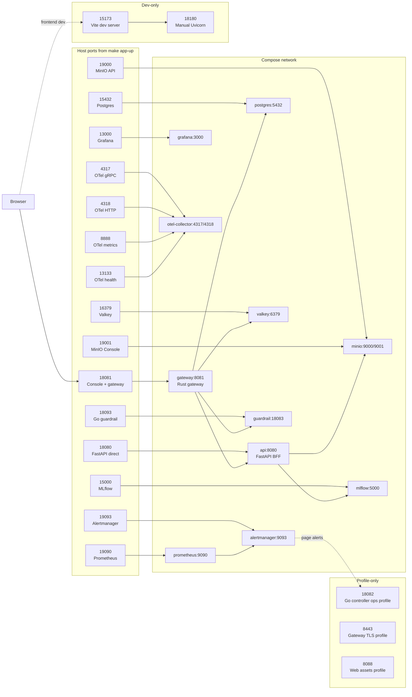

# TryOps Ports

These are the ports used by `make app-up`. They are not always the same as the raw `docker-compose.yml` defaults because the Makefile injects local-friendly host ports.

## Port Relationship Chart



## `make app-up` Ports

| Service | Default URL or port | Override variable | Notes |
| --- | --- | --- | --- |
| TryOps Console + Rust gateway | `http://127.0.0.1:18081` | `TRYOPS_GATEWAY_PORT` | Main app URL. Use this first. |
| FastAPI backend direct | `http://127.0.0.1:18080` | `TRYOPS_API_PORT` | Direct API/docs access. Gateway normally proxies this. |
| Postgres | `127.0.0.1:15432` | `TRYOPS_POSTGRES_PORT` | Database for the full Compose stack. |
| Valkey | `127.0.0.1:16379` | `TRYOPS_VALKEY_PORT` | Hot quota/rate counter store. |
| MinIO API | `http://127.0.0.1:19000` | `TRYOPS_MINIO_PORT` | Object/artifact storage API. |
| MinIO Console | `http://127.0.0.1:19001` | `TRYOPS_MINIO_CONSOLE_PORT` | Browser UI for MinIO. |
| MLflow | `http://127.0.0.1:15000` | `TRYOPS_MLFLOW_PORT` | Experiment/model tracking. |
| Prometheus | `http://127.0.0.1:19090` | `TRYOPS_PROMETHEUS_PORT` | Metrics database. |
| Alertmanager | `http://127.0.0.1:19093` | `TRYOPS_ALERTMANAGER_PORT` | Alert routing. |
| Grafana | `http://127.0.0.1:13000` | `TRYOPS_GRAFANA_PORT` | Dashboards. Grafana defaults to `admin` / `admin` on a fresh local volume. |
| Go guardrail sidecar | `127.0.0.1:18093` | `TRYOPS_GUARDRAIL_PORT` | LLM guardrail service. Usually called by gateway/API. Container port is `18083`. |
| OpenTelemetry gRPC | `127.0.0.1:4317` | `TRYOPS_OTEL_GRPC_PORT` | OTLP gRPC receiver. |
| OpenTelemetry HTTP | `127.0.0.1:4318` | `TRYOPS_OTEL_HTTP_PORT` | OTLP HTTP receiver. |
| OpenTelemetry metrics | `127.0.0.1:8888` | `TRYOPS_OTEL_METRICS_PORT` | Collector metrics endpoint. |
| OpenTelemetry health | `127.0.0.1:13133` | `TRYOPS_OTEL_HEALTH_PORT` | Collector health endpoint. |

`make app-up` starts:

```text
gateway, api, postgres, valkey, prometheus, alertmanager, otel-collector,
grafana, minio, mlflow, guardrail
```

It does not start the Vite dev server or the Go controller.

## Development-Only Ports

| Service | Default URL or port | Override variable | Notes |
| --- | --- | --- | --- |
| Manual FastAPI dev | `http://127.0.0.1:18180` | `--port` in the `uvicorn` command | Used when running FastAPI manually for frontend development. |
| Vite frontend dev | `http://127.0.0.1:15173` | Vite may auto-pick another port if busy | Started by `npm --prefix web run dev`; not started by `make app-up`. |

Frontend dev command:

```bash
VITE_TRYOPS_API_BASE=http://127.0.0.1:18180 npm --prefix web run dev
```

## Profile-Only Ports

These services are defined in Compose but are not part of the default `make app-up` service list.

| Service | Default URL or port | Override variable | Profile | Notes |
| --- | --- | --- | --- | --- |
| Go controller | `127.0.0.1:18082` | `TRYOPS_CONTROLLER_PORT` | `ops` | Handles `/health`, `/reconcile`, `/registry/webhook`, `/github/pr-webhook`, and `/alerts/webhook`. Alertmanager page alerts target `http://controller:18082/alerts/webhook` inside the Compose network. |
| Web assets server | `http://127.0.0.1:8088` | `TRYOPS_WEB_ASSETS_PORT` | `assets` | Static web-assets profile. |
| Gateway TLS | `https://127.0.0.1:8443` | `TRYOPS_GATEWAY_TLS_PORT` | `tls` | Optional TLS gateway profile. |

Start the controller profile when testing Alertmanager webhook delivery:

```bash
docker compose --profile ops up --build -d controller alertmanager prometheus
```

## Raw Compose Defaults

If you run `docker compose up` directly without the Makefile-provided environment variables, these host ports are different:

| Service | Raw Compose default | `make app-up` default |
| --- | --- | --- |
| Postgres | `5432` | `15432` |
| MinIO API | `9000` | `19000` |
| MinIO Console | `9001` | `19001` |
| MLflow | `5000` | `15000` |
| Prometheus | `9090` | `19090` |
| Alertmanager | `9093` | `19093` |
| Grafana | `3000` | `13000` |
| FastAPI backend | `8080` | `18080` |
| Rust gateway | `8081` | `18081` |
