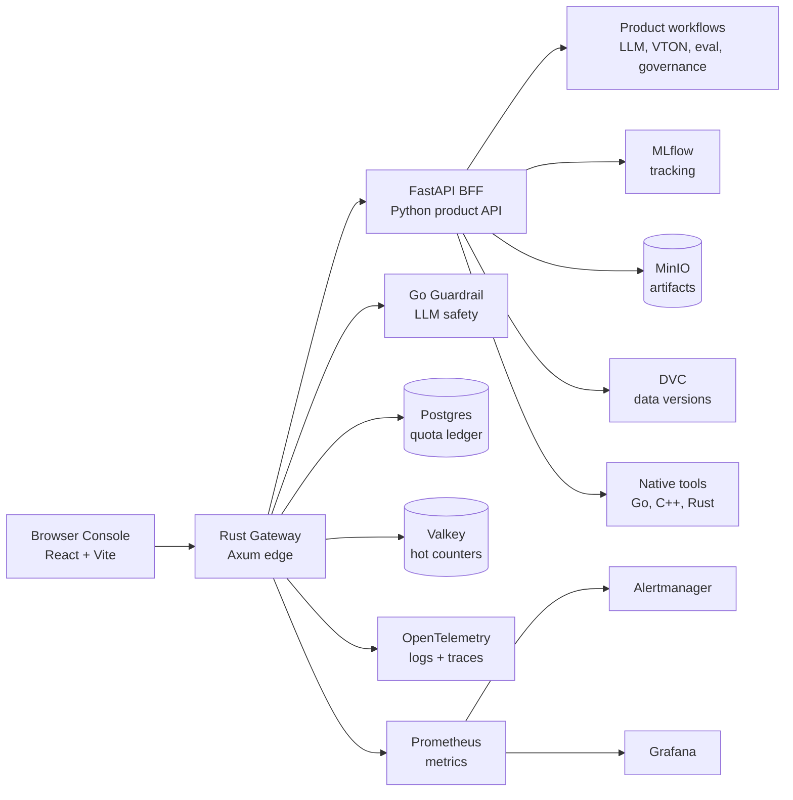
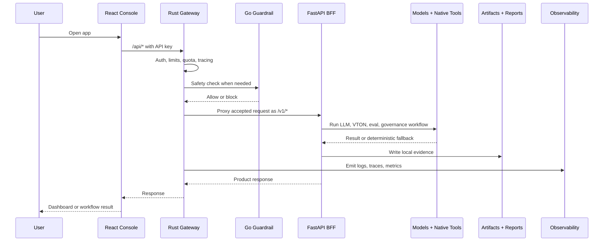
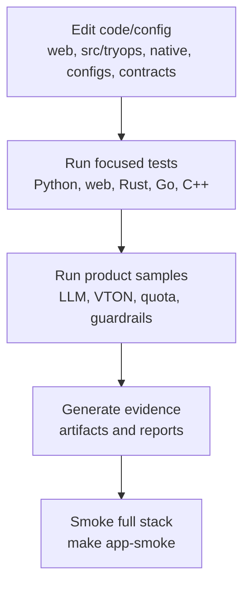
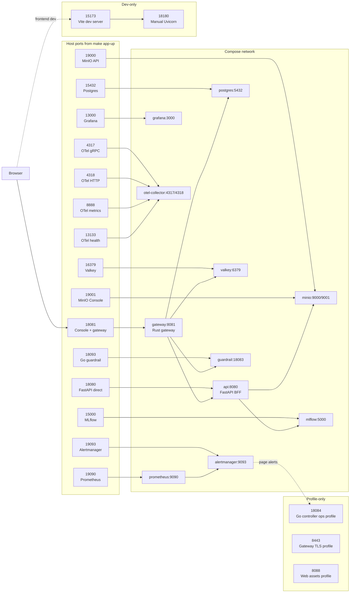

# TryOps

TryOps is an MLOps product stack for virtual try-on, optimized LLM serving, quota enforcement, guardrails, governance evidence, and production operations.

The repo is native-first at the product boundary: a Rust gateway protects the edge, a Python FastAPI backend coordinates product workflows, Go services handle platform/control-plane concerns, and C++ CLIs cover deterministic hot paths.

## Quick Start

Start the local product stack:

```bash
make app-up
```

The first run may take longer because it prepares the FASHN VTON runtime and model weights. Later runs reuse the cached setup.

Open the Console:

```text
http://127.0.0.1:18081
```

Create an account:

1. Click **Sign up** in the TryOps UI.
2. Register through Keycloak.
3. After login, TryOps bootstraps your workspace account automatically.
4. Open **My Account** to see quota, usage, members, and recent try-ons.

Keycloak is included in `make app-up`:

```text
http://127.0.0.1:18082
```

Local Keycloak admin login:

```text
username: tryops-admin
password: tryops-local-keycloak
```

The old static demo API keys still exist only as a local/dev fallback. Open the settings menu and paste one if you want to bypass login while debugging:

```text
tryops-viewer-demo-key
```

Check the stack:

```bash
curl -fsS http://127.0.0.1:18081/api/health
make app-smoke
```

Stop it and free the model-service RAM:

```bash
make app-down
```

For hot reload while editing the app:

```bash
make app-up-hotreload
```

Then open the Vite dev UI:

```text
http://127.0.0.1:18173
```

Hot reload mode keeps the Rust gateway/API edge on `http://127.0.0.1:18081`, starts the React dev server on `18173`, and runs FastAPI with `uvicorn --reload`. Use normal `make app-up` again when you want the production-style static build served by the gateway.

`make app-up --hotreload` is not valid GNU Make syntax because `--hotreload` is parsed as a Make option before the project Makefile can handle it. Use `make app-up-hotreload`, or the explicit flag form `TRYOPS_HOT_RELOAD=1 make app-up`.

Running `make app-up` again is safe. It reuses or recreates the Compose services in place, keeps persistent volumes, and removes the dev-only Vite container if you are switching back from hot reload. It does not wipe Postgres, MinIO, Grafana, or Valkey data. Docker build cache can grow after many rebuilds; reclaim only cache and dangling images with:

```bash
make app-prune-build-cache
```

### Accounts, IAM, And Quota

TryOps uses Keycloak for signup/login and the Rust gateway validates Keycloak access tokens before forwarding trusted identity headers to the API. On first login, the API creates one workspace account for that user in Postgres.

Useful Postgres tables:

| Table | What it stores |
| --- | --- |
| `accounts` | Workspace account, plan, status |
| `account_members` | Keycloak subject, email, display name, role |
| `requests` | LLM/VTON request history with `account_id` |
| `tryops_quota_usage` | Account-pooled quota ledger using the account as the quota subject |

MLflow tables such as `runs` are only populated by MLflow experiment runs. Product usage appears in `requests`, not MLflow `runs`.

### Real VTON Model

```bash
 HF_HOME="$PWD/artifacts/hf-home" \
  HF_HUB_CACHE="$PWD/artifacts/hf-home/hub" \
  HF_XET_CACHE="$PWD/artifacts/hf-home/xet" \
  XDG_CACHE_HOME="$PWD/artifacts/cache/xdg" \
  artifacts/venvs/fashn-vton/bin/hf auth login
```

The production VTON target uses the open-source FASHN VTON v1.5 model. `make app-up` prepares the model runtime if needed, starts a host-side FASHN router on port `18100`, then starts the Docker app. Docker reaches the router through `host.docker.internal`; the router owns the real GPU workers behind private Unix sockets by default.

The local FASHN loader is patched at startup to avoid the worst host-RAM spike: it builds the large model on PyTorch `meta`, loads safetensors directly to CUDA, and assigns those GPU tensors into the module before inference. This is enabled by default with `FASHN_VTON_GPU_FIRST_LOAD=1`; set `FASHN_VTON_GPU_FIRST_LOAD=0 make app-up` only if you need to debug the original vendor loading path.

For troubleshooting only, these advanced commands control just the model router:

```bash
make fashn-vton-router-bg
make fashn-vton-workers-status
make fashn-vton-router-stop
make fashn-vton-router
```

The old single-worker HTTP service is still available for isolated debugging on `18101`, but `make app-up` does not use it:

```bash
make fashn-vton-service-bg
make fashn-vton-stop
make fashn-vton-service
```

Then open `http://127.0.0.1:18081`, sign up or log in, go to VTON Studio, upload a person image and garment image, keep `FASHN VTON 1.5 GPU` selected, and press Generate. The generated image is saved under your account workspace, for example `artifacts/runtime/vton/accounts/<account_id>/<request_id>.png`.

VTON jobs are concurrency-limited by workspace plan so one account cannot flood the model queue:

| Plan | Default active VTON jobs |
| --- | ---: |
| `free` | 1 |
| `team` | 2 |
| `enterprise` | 4 |

Override these with `TRYOPS_VTON_CONCURRENCY_FREE`, `TRYOPS_VTON_CONCURRENCY_TEAM`, and `TRYOPS_VTON_CONCURRENCY_ENTERPRISE`. Actual simultaneous execution is also capped by `TRYOPS_VTON_JOB_WORKERS`, which defaults to `1` locally to reduce RAM/VRAM risk.

Quick local model check without the app:

```bash
make fashn-vton-sample
```

For manual frontend development without Docker hot reload:

```bash
python -m pip install -e ".[dev]"
make db-init
PYTHONPATH=src python -m uvicorn tryops.api:create_app --factory --host 0.0.0.0 --port 18180
```

In another terminal:

```bash
npm --prefix web ci
VITE_TRYOPS_API_BASE=http://127.0.0.1:18180 npm --prefix web run dev
```

Open `http://127.0.0.1:15173`.

## Architecture



Main responsibilities:

- `web/`: React Console for operators, admins, risk, and demo users.
- `native/rust/tryops-gateway`: edge gateway, static UI serving, auth preflight, quota, rate limits, payload limits, proxying, metrics, tracing, and semantic-cache admission.
- `src/tryops/`: FastAPI BFF, product API, model adapters, deterministic fallbacks, governance, evaluation, orchestration, and evidence helpers.
- `native/go/`: guardrail service, controllers, job runners, load tools, quota read models, CI/config/supply-chain contracts.
- `native/cpp/`: deterministic policy, metrics, image, VTON, LLM, cache, SLO, and evaluation CLIs.
- `infra/`: local observability, Postgres migrations, Kubernetes examples, backup and alerting assets.

## Tech Stack

- Frontend: React, Vite, TypeScript, lucide-react.
- API/BFF: Python 3.11+, FastAPI, Pydantic, Uvicorn.
- ML/MLOps: MLflow, DVC, Evidently, optional PyTorch/Transformers/Diffusers/vLLM.
- Edge/runtime: Rust, Axum, Tokio.
- Platform tools: Go.
- Native hot paths: C++17.
- Data/services: Postgres, Valkey, MinIO.
- Observability: OpenTelemetry, Prometheus, Alertmanager, Grafana.
- Local runtime: Docker Compose, Makefile targets, JSON contracts.

## Data Flow



Summary:

1. Console sends `/api/*` requests through the gateway.
2. Gateway enforces auth, limits, quota, tracing, and guardrails.
3. FastAPI runs product workflows and calls model/native paths.
4. Evidence lands in `artifacts/` and `reports/generated/`.
5. Observability flows to OpenTelemetry, Prometheus, and Grafana.

## Project Flow

Typical development loop:



Useful commands:

```bash
make test
make web-typecheck
make native-rust-test
make native-go-test
make native-cpp-test
make app-smoke
```

Common sample flows:

```bash
make vton-baseline-sample
make llm-benchmark-sample
make guardrail-sample
make quota-sample
make pipeline-sample
make deploy-package-sample
```

Real model runs are optional and need ML extras plus suitable hardware:

```bash
python -m pip install -e ".[dev,ml]"
make app-up
make llm-real-sample
```

## Repository Map

```text
web/                 React/Vite Console
src/tryops/          FastAPI app, pipelines, adapters, product logic
native/rust/         Rust gateway
native/go/           Go services and operational tools
native/cpp/          C++ deterministic CLIs
infra/               Observability, migrations, deployment assets
configs/             Runtime and policy config
contracts/           JSON schemas
samples/             Demo inputs and candidate payloads
scripts/             Automation and evidence generation
tests/               Python contract tests
docs/                Detailed architecture and operations notes
artifacts/           Generated local outputs, ignored by Git
reports/generated/   Generated cards/reports, ignored by Git
```





## Main Ports

When using `make app-up`:

```text
Console + gateway: http://127.0.0.1:18081
Keycloak IAM:      http://127.0.0.1:18082
Hot reload UI:    http://127.0.0.1:18173
FastAPI direct:    http://127.0.0.1:18080
FASHN VTON router: http://127.0.0.1:18100
Grafana:           http://127.0.0.1:13000
Loki logs API:     http://127.0.0.1:13100
Tempo traces API:  http://127.0.0.1:13200
OTel bridge:       http://127.0.0.1:19122/metrics
Prometheus:        http://127.0.0.1:19090
MLflow:            http://127.0.0.1:15000
MinIO API:         http://127.0.0.1:19000
MinIO Console:     http://127.0.0.1:19001
```

Grafana includes the **TryOps Observability Drilldown** dashboard. Use it to inspect FASHN VTON
model-service logs, async job lifecycle logs, and error logs by `job_id`, `request_id`, or
`trace_id`.

If port `18100` conflicts, start the router on another port and point the app at it:

```bash
FASHN_VTON_ROUTER_PORT=18110 TRYOPS_REAL_VTON_URL=http://host.docker.internal:18110 make app-up
```

## Deeper Docs

- Architecture: `docs/architecture.md`
- API contract: `docs/api_contract.md`
- Production app plan: `docs/production_app_plan.md`
- Orchestration: `docs/orchestration.md`
- Observability: `docs/observability_contract.md`
- Supply chain: `docs/supply_chain.md`
- Native modules: `native/README.md`
