# TryOps

TryOps is an MLOps product stack for AI virtual try-on, LLM-assisted product workflows, account quota, IAM, observability, model serving, and operational dashboards.

The local stack is designed around one command, but it still expects model endpoint configuration. `make app-up` starts the product stack, prepares the FASHN VTON runtime, starts the host-side VTON router, and then brings up the Docker Compose services.

## Tech Stack

<table>
  <tr>
    <th align="left">Frontend</th>
    <td>
      
      
      
      
      
    </td>
  </tr>
  <tr>
    <th align="left">Backend / Server</th>
    <td>
      
      
      
      
      
      
      
      
      
      
      
      
      
      
      
      
      
      
      
      
      
      
      
    </td>
  </tr>
  <tr>
    <th align="left">AI / ML Stack</th>
    <td>
      
      
      
      
      
    </td>
  </tr>
  <tr>
    <th align="left">Ops Stack</th>
    <td>
      
      
      
      
      
      
      
      
      
      
      
      
      
      
    </td>
  </tr>
</table>

## Visual Overview

### Product Screenshots

| Console | Try-on run |
| --- | --- |
| 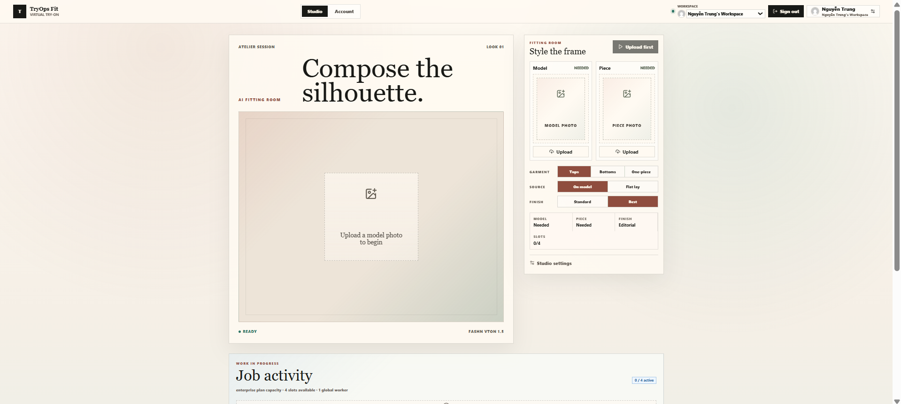 | 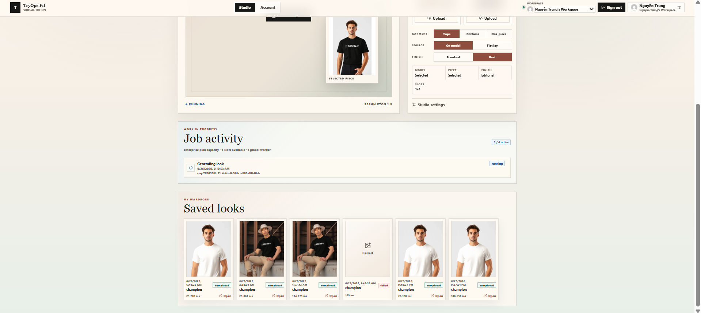 |

| Workspace | Keycloak IAM |
| --- | --- |
| 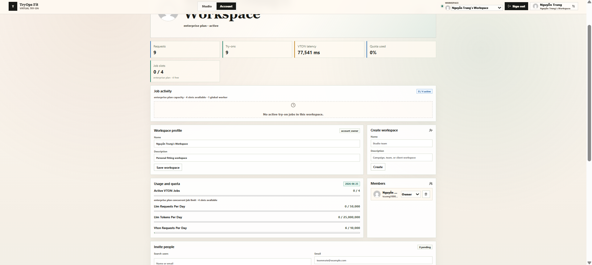 | 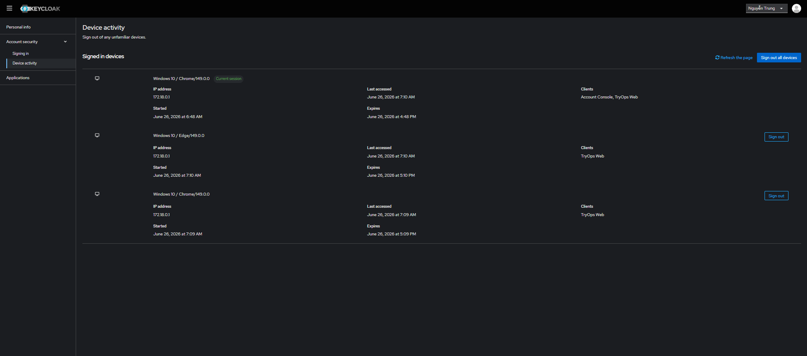 |

| Grafana | Log drilldown |
| --- | --- |
| 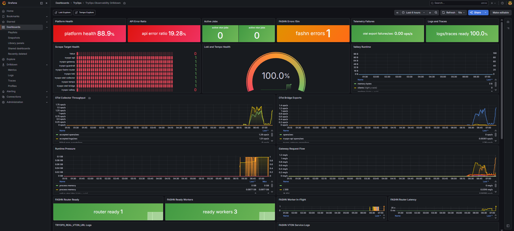 | 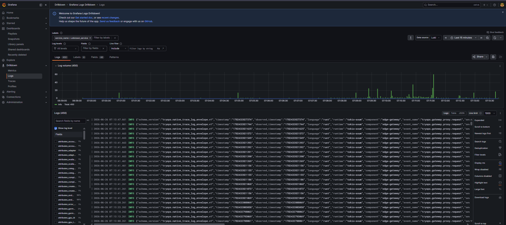 |

| MLflow | MinIO |
| --- | --- |
| 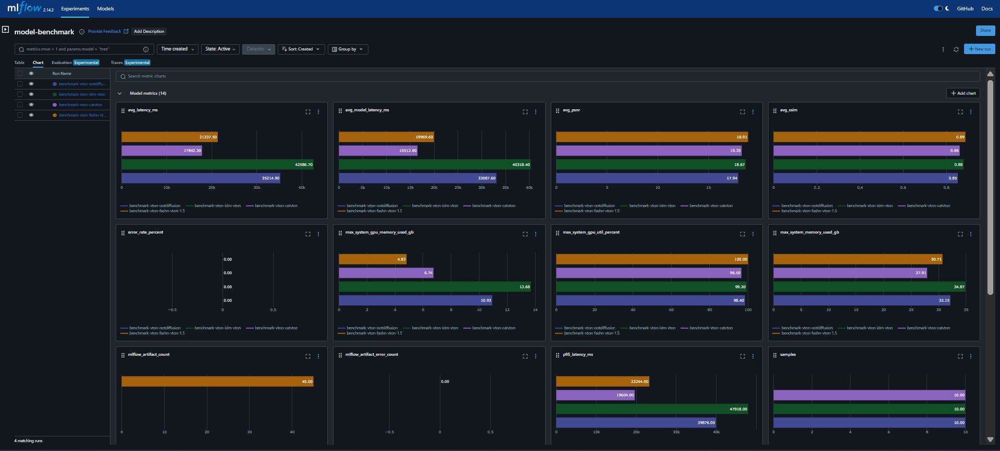 | 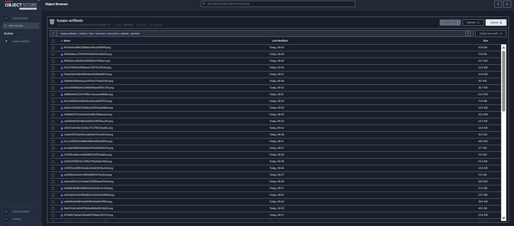 |

### CI/CD Pipeline

<p>
  
  
  
  
  
  
</p>

The project includes a GitHub Actions workflow at [.github/workflows/ci.yml](.github/workflows/ci.yml). It runs on pull requests, pushes to `main` / `production`, and manual dispatches.

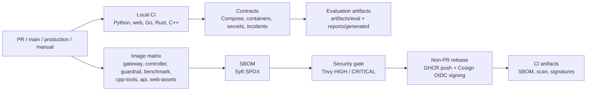

| Stage | Coverage |
| --- | --- |
| Test and build | Python contracts, React typecheck/build, native Go tests, Rust gateway tests, and C++ native tests. |
| Runtime contracts | Docker Compose validation, container contract checks, dependency lock, secret rotation, and incident workflow checks. |
| Supply chain | SBOM generation, vulnerability scan reports, CI contract validation, and uploaded evaluation artifacts. |
| Image pipeline | Builds seven container roles with Docker Buildx: gateway, controller, guardrail, benchmark, cpp-tools, api, and web-assets. |
| Release security | Pushes images to GHCR on non-PR runs, emits build provenance/SBOM, and signs release images with Cosign keyless OIDC. |

### Runtime Architecture

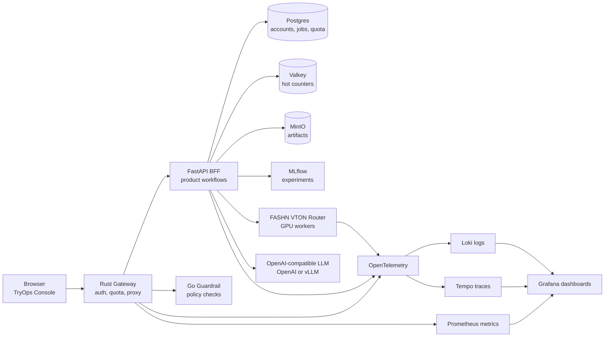

### C4 Context

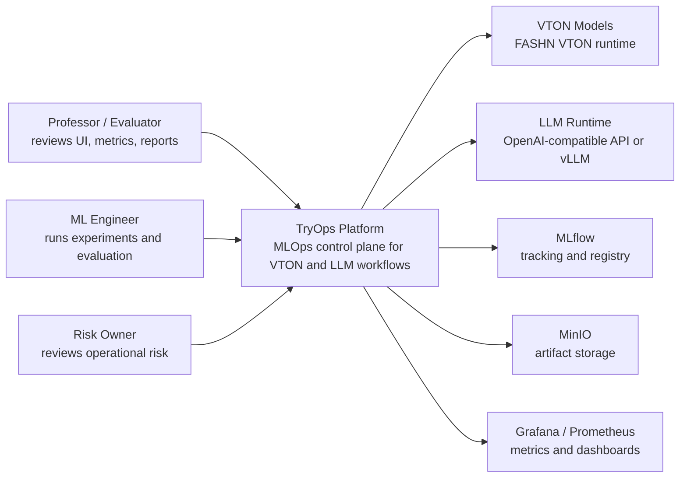

### Container View

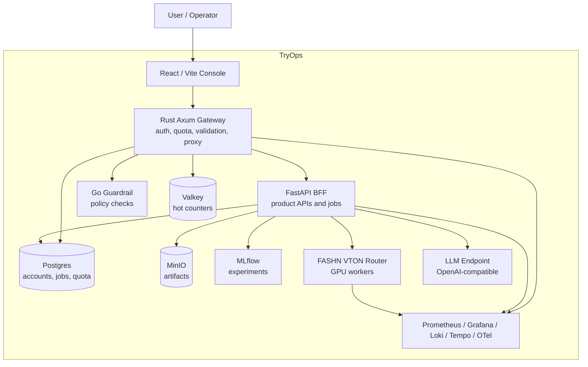

### Developer-Local Service Topology

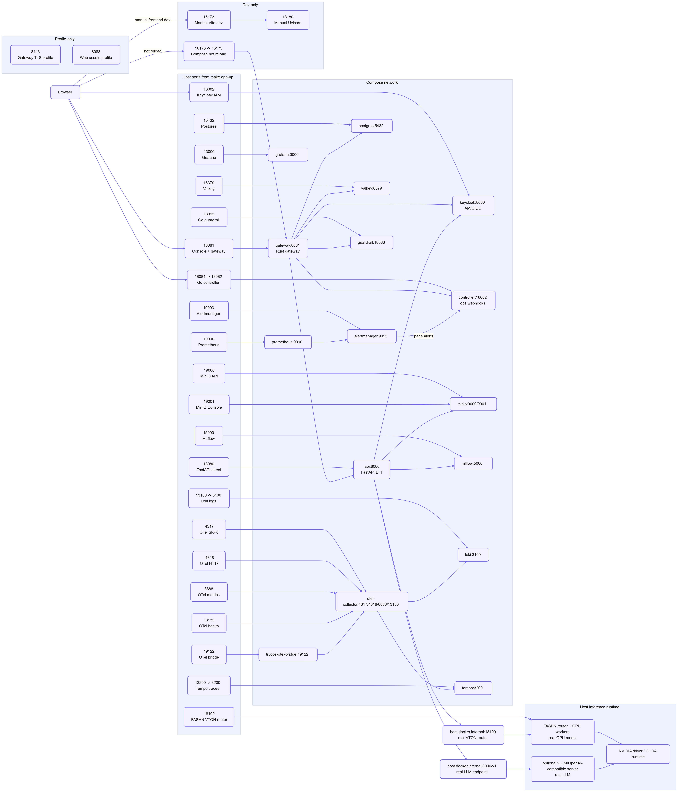

### FASHN VTON Model Flow

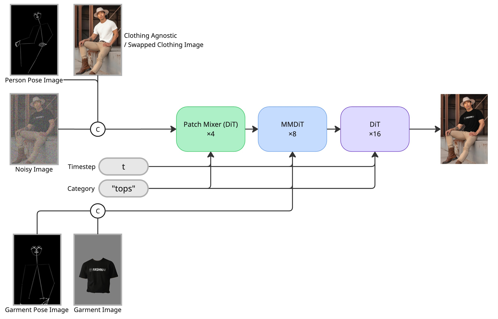

## Requirements

- Linux workstation or server with Docker and Docker Compose.
- Python 3.12 for the host-side FASHN VTON virtual environment.
- NVIDIA driver and CUDA-capable GPU for FASHN VTON inference.
- Internet access on first run for Docker images, Python packages, FASHN source, and model weights.
- One LLM endpoint:
  - OpenAI API, or
  - a local OpenAI-compatible server such as vLLM.

## Quick Start

```bash
git clone <repo-url>
cd mlops
cp .env.example .env
```

Edit `.env` and configure the LLM section.

For local vLLM:

```bash
vllm serve HuggingFaceTB/SmolLM2-135M-Instruct --host 127.0.0.1 --port 8000
```

```env
TRYOPS_LLM_BASE_URL=http://host.docker.internal:8000/v1
TRYOPS_LLM_MODEL=HuggingFaceTB/SmolLM2-135M-Instruct
TRYOPS_LLM_API_KEY=
```

Keep the VTON defaults unless you need a different GPU:

```env
TRYOPS_REAL_VTON_URL=http://host.docker.internal:18100
TRYOPS_FASHN_GPU_IDS=0
TRYOPS_FASHN_REQUIRE_CUDA=1
TRYOPS_FASHN_ALLOW_CPU_FALLBACK=0
```

Start the stack:

```bash
make app-up
```

Open the app:

```text
http://127.0.0.1:18081
```

The first run can take a long time because it creates the FASHN Python environment and downloads model weights. Later runs reuse cached artifacts under `artifacts/`.

## Accounts

Use the TryOps UI to sign up or sign in through Keycloak. The API creates a workspace account automatically after the first login.

Local Keycloak admin:

```text
URL:      http://127.0.0.1:18082
Username: tryops-admin
Password: tryops-local-keycloak
```

## Common Commands

| Command | Purpose |
| --- | --- |
| `make app-up` | Start the product stack and model-serving helpers. |
| `make app-down` | Stop Compose services and host-side model helpers. |
| `make app-smoke` | Check stack readiness through the gateway. |
| `make app-up-hotreload` | Start the app with React/FastAPI hot reload. |
| `make web-typecheck` | Type-check the React frontend. |
| `make native-rust-test` | Test the Rust gateway. |
| `make native-go-test` | Test Go services and tools. |
| `make native-cpp-test` | Test C++ native tools. |
| `make fashn-vton-workers-status` | Inspect the FASHN router and GPU workers. |

Hot reload UI:

```text
http://127.0.0.1:18173
```

## Main Local URLs

| Service | Default URL or port | Override variable | Notes |
| --- | --- | --- | --- |
| TryOps Console + Rust gateway | `http://127.0.0.1:18081` | `TRYOPS_GATEWAY_PORT` | Main app URL. Use this first. |
| FastAPI backend direct | `http://127.0.0.1:18080` | `TRYOPS_API_PORT` | Direct API/docs access. Gateway normally proxies this. |
| Keycloak IAM | `http://127.0.0.1:18082` | `TRYOPS_KEYCLOAK_PORT` | OIDC/IAM service. Container port is `8080`. |
| Go controller | `http://127.0.0.1:18084` | `TRYOPS_CONTROLLER_PORT` | Webhook/control-plane service. Container port is `18082`; Alertmanager uses `http://controller:18082/alerts/webhook` inside Compose. |
| FASHN VTON router | `http://127.0.0.1:18100` | `FASHN_VTON_ROUTER_PORT` | Host-side real VTON router started by `make app-up` before Compose. This is not a Docker Compose container. API reaches it from inside Docker through `host.docker.internal:18100`. |
| FASHN VTON single-worker debug | `http://127.0.0.1:18101` | `FASHN_VTON_PORT` | Optional direct service for isolated debugging with `make fashn-vton-service-bg`. `make app-up` does not use it. |
| Optional local vLLM/OpenAI-compatible LLM | `http://127.0.0.1:8000/v1` | `VLLM_PORT`, `VLLM_BASE_URL`, `TRYOPS_LLM_BASE_URL` | Host-side real LLM endpoint used only when self-hosting vLLM. If `TRYOPS_LLM_BASE_URL=https://api.openai.com/v1`, no local LLM port is needed. |
| Postgres | `127.0.0.1:15432` | `TRYOPS_POSTGRES_PORT` | Database for the full Compose stack. |
| Valkey | `127.0.0.1:16379` | `TRYOPS_VALKEY_PORT` | Hot quota/rate counter store. |
| MinIO API | `http://127.0.0.1:19000` | `TRYOPS_MINIO_PORT` | Object/artifact storage API. |
| MinIO Console | `http://127.0.0.1:19001` | `TRYOPS_MINIO_CONSOLE_PORT` | Browser UI for MinIO. |
| MLflow | `http://127.0.0.1:15000` | `TRYOPS_MLFLOW_PORT` | Experiment/model tracking. |
| Prometheus | `http://127.0.0.1:19090` | `TRYOPS_PROMETHEUS_PORT` | Metrics database. |
| Alertmanager | `http://127.0.0.1:19093` | `TRYOPS_ALERTMANAGER_PORT` | Alert routing. |
| Grafana | `http://127.0.0.1:13000` | `TRYOPS_GRAFANA_PORT` | Dashboards. Grafana defaults to `admin` / `admin` on a fresh local volume. |
| Loki | `http://127.0.0.1:13100` | `TRYOPS_LOKI_PORT` | Log store used by Grafana when `TRYOPS_OBSERVABILITY` is enabled. Container port is `3100`. |
| Tempo | `http://127.0.0.1:13200` | `TRYOPS_TEMPO_PORT` | Trace store used by Grafana when `TRYOPS_OBSERVABILITY` is enabled. Container port is `3200`. |
| Go guardrail sidecar | `127.0.0.1:18093` | `TRYOPS_GUARDRAIL_PORT` | LLM guardrail service. Usually called by gateway/API. Container port is `18083`. |
| OpenTelemetry gRPC | `127.0.0.1:4317` | `TRYOPS_OTEL_GRPC_PORT` | OTLP gRPC receiver. |
| OpenTelemetry HTTP | `127.0.0.1:4318` | `TRYOPS_OTEL_HTTP_PORT` | OTLP HTTP receiver. |
| OpenTelemetry metrics | `127.0.0.1:8888` | `TRYOPS_OTEL_METRICS_PORT` | Collector metrics endpoint. |
| OpenTelemetry health | `127.0.0.1:13133` | `TRYOPS_OTEL_HEALTH_PORT` | Collector health endpoint. |
| OTel bridge metrics | `http://127.0.0.1:19122/metrics` | `TRYOPS_OTEL_BRIDGE_PORT` | Bridges local TryOps JSONL logs/traces into OTLP for Grafana/Loki/Tempo. |

Grafana defaults to `admin` / `admin` on a fresh local volume. MinIO uses `TRYOPS_MINIO_ROOT_USER` and `TRYOPS_MINIO_ROOT_PASSWORD` from `.env`.

## Observability

`make app-up` enables the observability profile by default. Grafana includes dashboards for:

- API and gateway health.
- VTON job lifecycle.
- FASHN router and worker logs.
- `TRYOPS_REAL_VTON_URL` calls from the API.
- Prometheus metrics.
- Loki logs.
- Tempo traces.

Useful local files:

```text
artifacts/logs/fashn-vton-router.log
artifacts/logs/fashn_vton_router_events.jsonl
artifacts/logs/fashn_vton_events.jsonl
```

## Repository Map

| Path | Purpose |
| --- | --- |
| `web/` | React/Vite TryOps Console. |
| `src/tryops/` | FastAPI BFF, product APIs, model adapters, jobs, and workflow logic. |
| `native/rust/` | Rust gateway and edge runtime. |
| `native/go/` | Guardrail service, controllers, job tools, and operational utilities. |
| `native/cpp/` | Native command-line tools for policy, metrics, eval, and performance paths. |
| `configs/` | Runtime and policy configuration. |
| `contracts/` | JSON schemas and service contracts. |
| `docs/` | Architecture and operations notes. |
| `infra/` | Observability, deployment, and migration assets. |
| `scripts/` | Automation, benchmarks, model-serving helpers, and report tooling. |
| `tests/` | Python contract and integration tests. |
| `report/` | Final report assets, screenshots, diagrams, and generated PDFs. |
| `artifacts/` | Local generated outputs and model/runtime caches. |

## Troubleshooting

If `make app-up` stops at the LLM check, set `TRYOPS_LLM_BASE_URL`, `TRYOPS_LLM_MODEL`, and `TRYOPS_LLM_API_KEY`, or start a local vLLM server.

If FASHN weight download fails because of Hugging Face cache permissions, keep these values in `.env`:

```env
HF_HOME=artifacts/hf-home
HF_HUB_CACHE=artifacts/hf-home/hub
HF_XET_CACHE=artifacts/hf-home/xet
HF_HUB_DISABLE_XET=1
XDG_CACHE_HOME=artifacts/cache/xdg
TMPDIR=artifacts/cache/tmp
```

If GPU workers do not start, check:

```bash
nvidia-smi
make fashn-vton-workers-status
tail -100 artifacts/logs/fashn-vton-router.log
```
