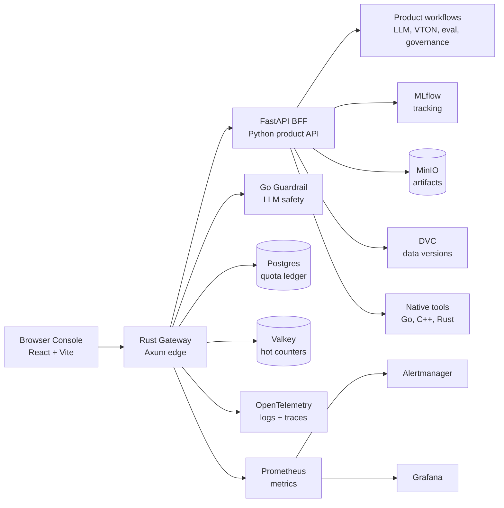
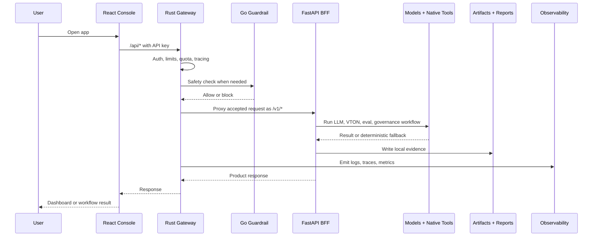
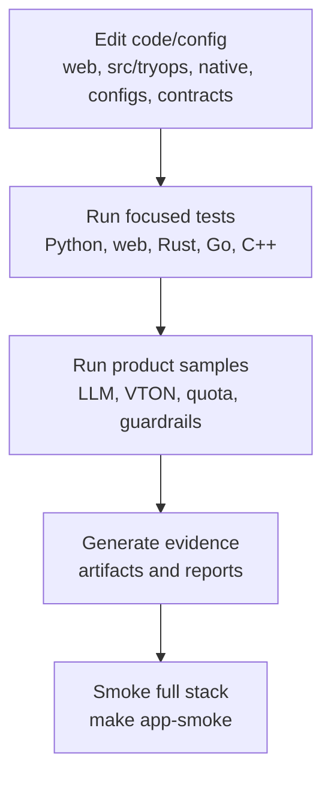
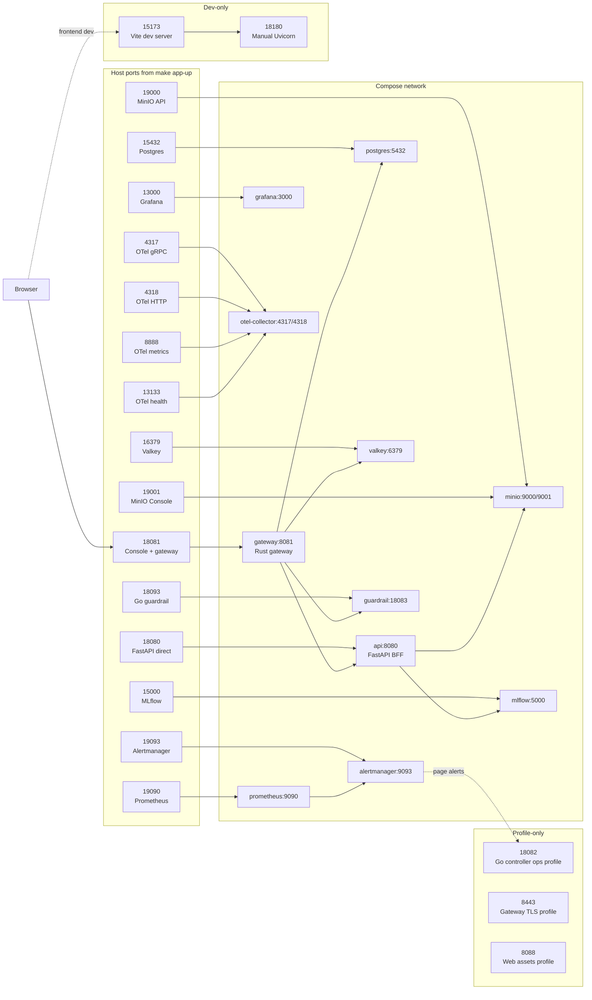

# TryOps

TryOps is an MLOps product stack for virtual try-on, optimized LLM serving, quota enforcement, guardrails, governance evidence, and production operations.

The repo is native-first at the product boundary: a Rust gateway protects the edge, a Python FastAPI backend coordinates product workflows, Go services handle platform/control-plane concerns, and C++ CLIs cover deterministic hot paths.

## Quick Start

Start the local product stack:

```bash
make app-up
```

Open the Console:

```text
http://127.0.0.1:18081
```

Use a demo API key:

```text
tryops-viewer-demo-key
```

Check the stack:

```bash
curl -fsS http://127.0.0.1:18081/api/health
make app-smoke
```

Stop it:

```bash
make app-down
```

### Real VTON Model

The production VTON target uses the open-source FASHN VTON v1.5 model. It runs as a host GPU service, then the Docker app calls it through `host.docker.internal`.

One-time setup:

```bash
make fashn-vton-download
```

Start the model service in one terminal:

```bash
make fashn-vton-service
```

This binds the model service on port `18101` so Docker can reach it through `host.docker.internal`.

Start the app in another terminal:

```bash
make app-up
```

Then open `http://127.0.0.1:18081`, enter `tryops-viewer-demo-key`, go to VTON Studio, upload a person image and garment image, keep `FASHN VTON 1.5 GPU` selected, and press Run. The generated image is saved to the output path shown in the UI, usually `artifacts/runtime/vton/console-output.png`.

Quick local model check without the app:

```bash
make fashn-vton-sample
```

For frontend development:

```bash
python -m pip install -e ".[dev]"
make db-init
PYTHONPATH=src python -m uvicorn tryops.api:create_app --factory --host 0.0.0.0 --port 18180
```

In another terminal:

```bash
npm --prefix web ci
VITE_TRYOPS_API_BASE=http://127.0.0.1:18180 npm --prefix web run dev
```

Open `http://127.0.0.1:15173`.

## Architecture



Main responsibilities:

- `web/`: React Console for operators, admins, risk, and demo users.
- `native/rust/tryops-gateway`: edge gateway, static UI serving, auth preflight, quota, rate limits, payload limits, proxying, metrics, tracing, and semantic-cache admission.
- `src/tryops/`: FastAPI BFF, product API, model adapters, deterministic fallbacks, governance, evaluation, orchestration, and evidence helpers.
- `native/go/`: guardrail service, controllers, job runners, load tools, quota read models, CI/config/supply-chain contracts.
- `native/cpp/`: deterministic policy, metrics, image, VTON, LLM, cache, SLO, and evaluation CLIs.
- `infra/`: local observability, Postgres migrations, Kubernetes examples, backup and alerting assets.

## Tech Stack

- Frontend: React, Vite, TypeScript, lucide-react.
- API/BFF: Python 3.11+, FastAPI, Pydantic, Uvicorn.
- ML/MLOps: MLflow, DVC, Evidently, optional PyTorch/Transformers/Diffusers/vLLM.
- Edge/runtime: Rust, Axum, Tokio.
- Platform tools: Go.
- Native hot paths: C++17.
- Data/services: Postgres, Valkey, MinIO.
- Observability: OpenTelemetry, Prometheus, Alertmanager, Grafana.
- Local runtime: Docker Compose, Makefile targets, JSON contracts.

## Data Flow



Summary:

1. Console sends `/api/*` requests through the gateway.
2. Gateway enforces auth, limits, quota, tracing, and guardrails.
3. FastAPI runs product workflows and calls model/native paths.
4. Evidence lands in `artifacts/` and `reports/generated/`.
5. Observability flows to OpenTelemetry, Prometheus, and Grafana.

## Project Flow

Typical development loop:



Useful commands:

```bash
make test
make web-typecheck
make native-rust-test
make native-go-test
make native-cpp-test
make app-smoke
```

Common sample flows:

```bash
make vton-baseline-sample
make llm-benchmark-sample
make guardrail-sample
make quota-sample
make pipeline-sample
make deploy-package-sample
```

Real model runs are optional and need ML extras plus suitable hardware:

```bash
python -m pip install -e ".[dev,ml]"
make fashn-vton-download
make fashn-vton-service
make llm-real-sample
```

## Repository Map

```text
web/                 React/Vite Console
src/tryops/          FastAPI app, pipelines, adapters, product logic
native/rust/         Rust gateway
native/go/           Go services and operational tools
native/cpp/          C++ deterministic CLIs
infra/               Observability, migrations, deployment assets
configs/             Runtime and policy config
contracts/           JSON schemas
samples/             Demo inputs and candidate payloads
scripts/             Automation and evidence generation
tests/               Python contract tests
docs/                Detailed architecture and operations notes
artifacts/           Generated local outputs, ignored by Git
reports/generated/   Generated cards/reports, ignored by Git
```





## Main Ports

When using `make app-up`:

```text
Console + gateway: http://127.0.0.1:18081
FastAPI direct:    http://127.0.0.1:18080
FASHN VTON model:  http://127.0.0.1:18101
Grafana:           http://127.0.0.1:13000
Prometheus:        http://127.0.0.1:19090
MLflow:            http://127.0.0.1:15000
MinIO API:         http://127.0.0.1:19000
MinIO Console:     http://127.0.0.1:19001
```

If port `18101` conflicts, start the model service on another port and point the app at it:

```bash
FASHN_VTON_PORT=18111 make fashn-vton-service
TRYOPS_REAL_VTON_URL=http://host.docker.internal:18111 make app-up
```

## Deeper Docs

- Architecture: `docs/architecture.md`
- API contract: `docs/api_contract.md`
- Production app plan: `docs/production_app_plan.md`
- Orchestration: `docs/orchestration.md`
- Observability: `docs/observability_contract.md`
- Supply chain: `docs/supply_chain.md`
- Native modules: `native/README.md`
