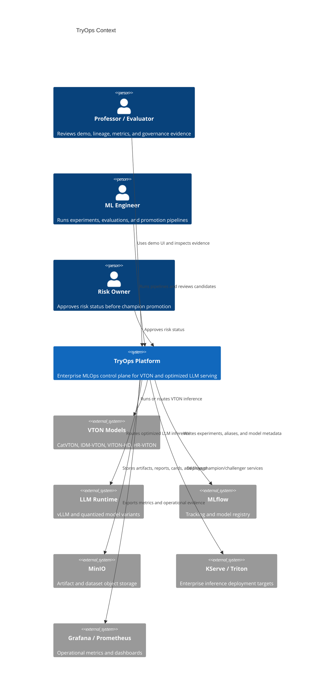

# C4 Context Diagram

```mermaid
C4Context
    title TryOps Context

    Person(professor, "Professor / Evaluator", "Reviews demo, lineage, metrics, and governance evidence")
    Person(ml_engineer, "ML Engineer", "Runs experiments, evaluations, and promotion pipelines")
    Person(risk_owner, "Risk Owner", "Approves risk status before champion promotion")

    System(tryops, "TryOps Platform", "Enterprise MLOps control plane for VTON and optimized LLM serving")

    System_Ext(vton_models, "VTON Models", "CatVTON, IDM-VTON, VITON-HD, HR-VITON")
    System_Ext(llm_runtime, "LLM Runtime", "vLLM and quantized model variants")
    System_Ext(mlflow, "MLflow", "Tracking and model registry")
    System_Ext(minio, "MinIO", "Artifact and dataset object storage")
    System_Ext(kserve, "KServe / Triton", "Enterprise inference deployment targets")
    System_Ext(grafana, "Grafana / Prometheus", "Operational metrics and dashboards")

    Rel(professor, tryops, "Uses demo UI and inspects evidence")
    Rel(ml_engineer, tryops, "Runs pipelines and reviews candidates")
    Rel(risk_owner, tryops, "Approves risk status")
    Rel(tryops, vton_models, "Runs or routes VTON inference")
    Rel(tryops, llm_runtime, "Routes optimized LLM inference")
    Rel(tryops, mlflow, "Writes experiments, aliases, and model metadata")
    Rel(tryops, minio, "Stores artifacts, reports, cards, and lineage")
    Rel(tryops, kserve, "Deploys champion/challenger services")
    Rel(tryops, grafana, "Exports metrics and operational evidence")
```

