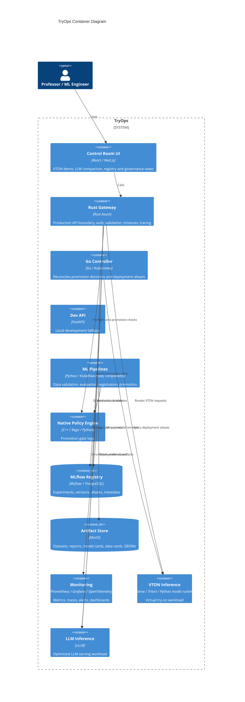

# C4 Container Diagram

```mermaid
C4Container
    title TryOps Container Diagram

    Person(user, "Professor / ML Engineer")

    System_Boundary(tryops, "TryOps") {
        Container(ui, "Control Room UI", "React / Next.js", "VTON demo, LLM comparison, registry and governance views")
        Container(gateway, "Rust Gateway", "Rust Axum", "Production API boundary, auth, validation, timeouts, tracing")
        Container(controller, "Go Controller", "Go / Kubernetes", "Reconciles promotion decisions and deployment aliases")
        Container(dev_api, "Dev API", "FastAPI", "Local development fallback")
        Container(pipelines, "ML Pipelines", "Python / Kubeflow-ready components", "Data validation, evaluation, registration, promotion")
        Container(policy, "Native Policy Engine", "C++ / Rego / Python", "Promotion gate logic")
        ContainerDb(registry, "MLflow Registry", "MLflow + PostgreSQL", "Experiments, versions, aliases, metadata")
        ContainerDb(artifacts, "Artifact Store", "MinIO", "Datasets, reports, model cards, data cards, SBOMs")
        Container(monitors, "Monitoring", "Prometheus / Grafana / OpenTelemetry", "Metrics, traces, alerts, dashboards")
        Container(vton, "VTON Inference", "KServe / Triton / Python model runtime", "Virtual try-on workload")
        Container(llm, "LLM Inference", "vLLM", "Optimized LLM serving workload")
    }

    Rel(user, ui, "Uses")
    Rel(ui, gateway, "Calls")
    Rel(gateway, policy, "Preflight and promotion checks")
    Rel(gateway, vton, "Routes VTON requests")
    Rel(gateway, llm, "Routes LLM requests")
    Rel(gateway, monitors, "Emits metrics/traces")
    Rel(controller, registry, "Reads promotion state")
    Rel(controller, vton, "Syncs deployment aliases")
    Rel(controller, llm, "Syncs deployment aliases")
    Rel(pipelines, registry, "Logs runs and model versions")
    Rel(pipelines, artifacts, "Writes evidence artifacts")
    Rel(pipelines, policy, "Evaluates candidates")
```

