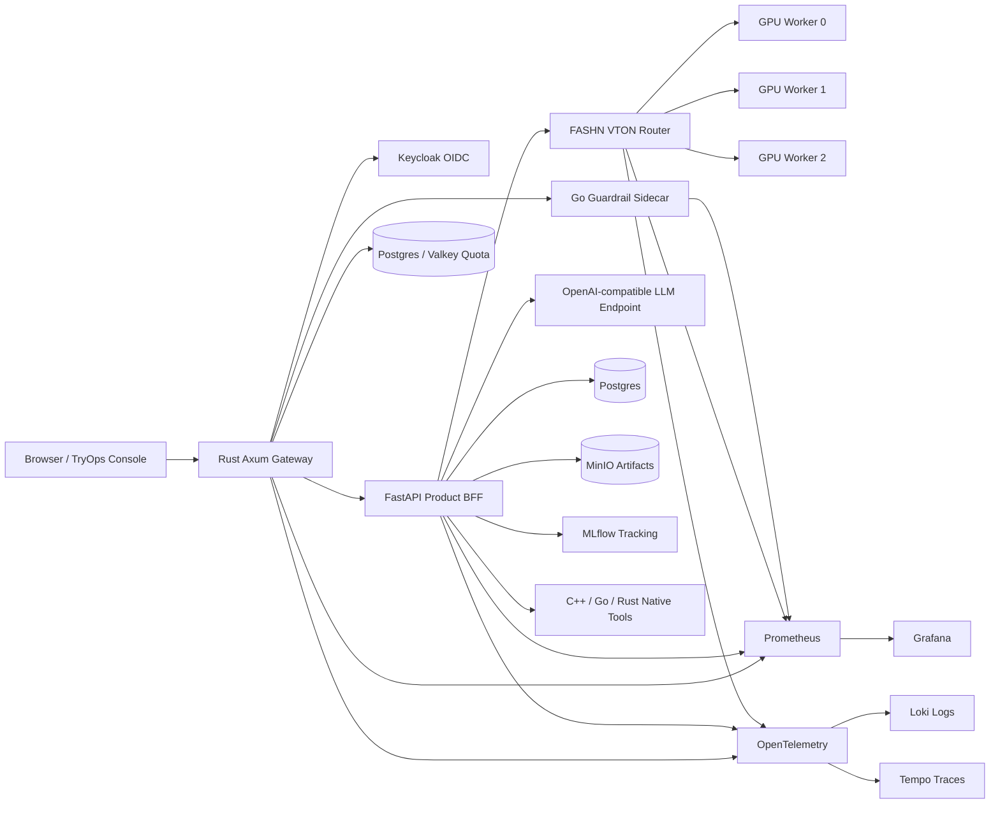

# ĐẠI HỌC QUỐC GIA THÀNH PHỐ HỒ CHÍ MINH
# TRƯỜNG ĐẠI HỌC CÔNG NGHỆ THÔNG TIN
# KHOA KHOA HỌC MÁY TÍNH

**Môn học:** CS317.Q22 - Phát triển và vận hành hệ thống máy học  
**GVHD:** ThS. Đỗ Văn Tiến

# BÁO CÁO ĐỒ ÁN CUỐI KỲ

# TryOps: Nền tảng MLOps doanh nghiệp cho Virtual Try-On và phục vụ LLM hiệu quả

**Định hướng:** Evidence Gates, Native Control Plane, Real Model Serving, Observability

| Sinh viên thực hiện | MSSV | Vai trò chính |
| --- | --- | --- |
| Nguyen Tran Nhat Trung | 23521684 | Thiết kế hệ thống, sản phẩm TryOps Console, VTON runtime |
| Hoang Minh Thai | 23521414 | MLOps, quan sát hệ thống, hạ tầng và benchmark |
| Pham Hai Dang | 23520233 | Native control plane, governance, LLM optimization |

**TP. Hồ Chí Minh, tháng 7 năm 2026**

---

## Tóm tắt

TryOps là một nền tảng MLOps theo định hướng doanh nghiệp, dùng hai workload đại diện để kiểm chứng năng lực vận hành mô hình trong môi trường gần sản xuất: Virtual Try-On (VTON) và Large Language Model (LLM). Khác với đồ án chỉ dừng ở notebook hoặc một giao diện demo, TryOps tập trung vào toàn bộ vòng đời vận hành mô hình: quản lý dữ liệu, thực nghiệm, đánh giá, policy gate, model registry, triển khai, quota, quan sát hệ thống, bảo mật, rollback và bằng chứng truy vết.

Hệ thống gồm bốn lớp chính. Lớp sản phẩm là TryOps Console viết bằng React/Vite, cho phép người dùng đăng nhập, gửi yêu cầu LLM, tải ảnh VTON, theo dõi job, xem lịch sử, registry, governance và dashboard. Lớp biên là Rust Axum Gateway, chịu trách nhiệm xác thực, quota, rate limit, payload limit, guardrail dispatch, static serving và reverse proxy. Lớp điều phối là FastAPI BFF trong `src/tryops`, quản lý API nghiệp vụ, job VTON, artifact, tài khoản, request history, evaluation, promotion và lineage. Lớp inference và native control plane gồm FASHN VTON router/worker trên host GPU, LLM endpoint tương thích OpenAI/vLLM hoặc OpenAI API, Go services và nhiều CLI C++ cho policy, metrics, cache, SLO, supply chain và evaluation.

Trong cấu hình sản xuất cục bộ, TryOps được thiết kế để chạy mô hình thật. `.env.example` đặt `TRYOPS_REQUIRE_REAL_MODELS=1`, `TRYOPS_ALLOW_DETERMINISTIC_BASELINE=0`, `TRYOPS_ENABLE_LOCAL_API_KEYS=0`, `TRYOPS_ENABLE_DEV_API_KEY_FALLBACK=0`. Adapter LLM thật trong `src/tryops/pipelines/llm_openai_compatible.py` không có deterministic fallback; khi endpoint thật không hoạt động, nó trả lỗi. Adapter VTON thật trong `src/tryops/pipelines/vton_remote.py` gọi FASHN router qua `TRYOPS_REAL_VTON_URL` và cũng không rơi về compositor baseline. Baseline trong repo chỉ dùng cho chẩn đoán, kiểm thử contract và so sánh chất lượng, không được trình bày như sản phẩm production.

Kết quả hệ thống hiện tại cho thấy TryOps đã có một stack có thể chạy bằng `make app-up`, gồm Postgres, Valkey, MinIO, MLflow, Keycloak, FastAPI, Rust Gateway, Go guardrail, Prometheus, Grafana, Loki, Tempo, OpenTelemetry Collector và host-side FASHN VTON router. Hệ thống hỗ trợ upload ảnh, submit VTON job bất đồng bộ, lưu artifact, quota theo workspace, structured logs, Prometheus metrics, Grafana dashboards và mô hình phục vụ nhiều GPU thông qua router. Các tài liệu `PORT.md`, `docs/multi_gpu_fashn_serving_plan.md`, `docs/observability_contract.md` và slide `slide/main.tex` xác định rõ ranh giới triển khai, port surface, observability và yêu cầu không dùng mock/fallback như sản phẩm.

Từ khóa: MLOps, Virtual Try-On, FASHN VTON, LLM Serving, vLLM, OpenAI-compatible API, Rust Gateway, FastAPI, Go, C++, Prometheus, Grafana, Loki, MLflow, MinIO, Keycloak, governance, policy gate.

---

## Mục lục

1. Giới thiệu  
2. Cơ sở lý thuyết và công nghệ  
3. Phân tích yêu cầu  
4. Kiến trúc hệ thống  
5. Thiết kế và triển khai các thành phần chính  
6. Thực nghiệm và đánh giá  
7. Triển khai, vận hành và giám sát  
8. Bảo mật, quản trị mô hình và trách nhiệm AI  
9. Hạn chế hiện tại và hướng phát triển  
10. Kết luận  
11. Tài liệu và mã nguồn tham khảo  
12. Phụ lục lệnh vận hành

---

# Chương 1. Giới thiệu

## 1.1. Lý do chọn đề tài

Trong nhiều đồ án AI, kết quả thường dừng ở việc huấn luyện một mô hình hoặc dựng một giao diện có thể trình diễn. Tuy nhiên, trong môi trường sản xuất, chất lượng mô hình chỉ là một phần của bài toán. Một hệ thống học máy thật phải trả lời được các câu hỏi vận hành:

- Dữ liệu, model weights, code, cấu hình và hardware của một output có truy vết được không?
- Candidate model có bị chặn khi không đạt quality, latency, security hoặc governance gate không?
- Khi inference lỗi, hệ thống có báo lỗi thật hay âm thầm fallback sang mock/baseline?
- Quota và cost có được kiểm soát theo workspace không?
- Log, metrics và traces có đủ để debug sự cố không?
- Có thể rollback và giải trình quyết định promotion không?

TryOps chọn VTON và LLM làm hai workload kiểm chứng vì chúng có đặc điểm rất khác nhau. VTON là workload thị giác, nặng GPU, có rủi ro lớn về chất lượng ảnh, quyền riêng tư ảnh người dùng và artifact storage. LLM là workload ngôn ngữ, nhạy với latency, throughput, token cost, guardrail, prompt injection và semantic cache. Nếu cùng một nền tảng có thể quản lý được hai workload này, nền tảng đó thể hiện rõ tư duy MLOps hơn một demo đơn lẻ.

## 1.2. Mục tiêu đề tài

Mục tiêu tổng quát là xây dựng một nền tảng MLOps có thể vận hành mô hình thật cho người dùng cuối, đồng thời có bằng chứng đánh giá, quan sát, governance và kiểm soát rủi ro.

Mục tiêu cụ thể:

1. Xây dựng TryOps Console cho người dùng, admin và operator.
2. Xây dựng Rust Gateway làm điểm vào chính của hệ thống.
3. Xây dựng FastAPI BFF điều phối nghiệp vụ LLM, VTON, job, account, artifact và governance.
4. Chạy VTON bằng FASHN VTON v1.5 qua host-side router và GPU worker thật.
5. Hỗ trợ LLM thông qua endpoint OpenAI-compatible, gồm vLLM self-host hoặc OpenAI API.
6. Tích hợp Keycloak cho đăng nhập OIDC và workspace account.
7. Tích hợp Postgres, Valkey, MinIO và MLflow cho dữ liệu sản phẩm, quota, artifact và tracking.
8. Tích hợp Prometheus, Grafana, Loki, Tempo và OpenTelemetry cho quan sát hệ thống.
9. Thiết kế governance, supply-chain evidence, policy gate và audit trail.
10. Ghi nhận rõ phần đã hoàn thiện, phần còn hạn chế và phần không được trình bày như production.

## 1.3. Phạm vi đề tài

| Hạng mục | Trong phạm vi | Ngoài phạm vi hoặc còn mở |
| --- | --- | --- |
| Sản phẩm | TryOps Console, LLM Playground, VTON Studio, Account, Registry, Governance, Dashboard | UI production polish, accessibility/export đầy đủ |
| VTON | FASHN VTON router, GPU worker, upload ảnh, async job, artifact output | Representative human preference study, full model zoo production |
| LLM | OpenAI-compatible endpoint, vLLM/OpenAI configuration, guardrails | Live vLLM benchmark nếu môi trường chưa chạy vLLM |
| MLOps | MLflow, MinIO, promotion evidence, model/data cards, policy gate | Production cluster-grade KServe/Kubeflow |
| Observability | Prometheus, Grafana dashboards, Loki/Tempo/OTel bridge, structured logs | GPU/process exporters đầy đủ cho shared datacenter |
| Security | Keycloak, Rust gateway auth, quota, guardrail, supply-chain evidence | External Secrets/Vault production sync hoàn chỉnh |
| Networking | Developer-local ports và shared datacenter plan | Reverse proxy/ingress production chưa đóng gói thành profile cuối |

## 1.4. Đóng góp chính

Đóng góp chính của đồ án không phải là một mô hình VTON hay LLM mới, mà là hệ điều hành MLOps xung quanh mô hình:

- Một product stack có thể chạy bằng `make app-up`.
- Một production boundary native-first: Rust ở edge, Go ở sidecar/controller/load tools, C++ ở policy/metrics/eval tools.
- Một VTON serving abstraction: API chỉ biết `TRYOPS_REAL_VTON_URL`, còn router ẩn worker count, GPU pinning, socket path và per-worker metrics.
- Một cấu hình mặc định ưu tiên mô hình thật, fail-closed khi real model không sẵn sàng, không biến baseline thành sản phẩm.
- Một hệ thống observability có Grafana dashboard, Loki logs, Tempo traces, Prometheus metrics và structured log theo `job_id`/`request_id`.
- Một governance pipeline có policy gate, supply-chain evidence, dependency lock, model scan, provenance và promotion lifecycle.

---

# Chương 2. Cơ sở lý thuyết và công nghệ

## 2.1. MLOps

MLOps là tập hợp các phương pháp đưa mô hình học máy từ giai đoạn nghiên cứu sang vận hành ổn định. Một hệ thống MLOps tốt phải có:

- Versioning cho dữ liệu, code, config và model.
- Experiment tracking và artifact storage.
- Evaluation tự động trước khi promotion.
- Model registry và lifecycle stage: candidate, challenger, champion, rejected, archived.
- CI/CD và policy gate.
- Observability: metrics, logs, traces, drift, quality.
- Security, quota, guardrails và rollback.

Trong TryOps, MLOps được thể hiện qua `MLflow`, `DVC`, `MinIO`, `Postgres`, `reports/generated`, `artifacts/eval`, các Makefile targets và native policy/evaluation tools.

## 2.2. Virtual Try-On

Virtual Try-On nhận đầu vào là ảnh người mẫu/người dùng và ảnh trang phục, sau đó sinh ảnh người mặc trang phục đó. Workload này khó vận hành vì:

- Output là ảnh, lỗi có thể là méo hình, sai pose, mất texture, sai identity hoặc artifact vùng biên.
- Tài nguyên GPU/RAM lớn.
- Ảnh người dùng là dữ liệu nhạy cảm.
- Cần lưu cả input, output, report, metrics và sidecar artifact để audit.
- Cần phân biệt rõ model thật với baseline hoặc preprocessing.

TryOps dùng FASHN VTON v1.5 làm đường phục vụ production-local chính. Baseline naive overlay chỉ dùng để kiểm thử pipeline/evaluation và không bật mặc định cho người dùng cuối.

## 2.3. LLM Serving

LLM serving cần đo latency, throughput, token cost, quota, guardrail, cache và lỗi endpoint. TryOps chuẩn hóa LLM thật qua OpenAI-compatible API:

- Self-host: `vllm serve <model> --host 127.0.0.1 --port 8000`.
- Managed API: `TRYOPS_LLM_BASE_URL=https://api.openai.com/v1`.
- Model được cấu hình bằng `TRYOPS_LLM_MODEL`.
- API key được cấu hình bằng secret/env, không hardcode trong code.

Adapter `llm_openai_compatible.py` không fallback deterministic khi endpoint lỗi. Điều này quan trọng để tránh capability misrepresentation.

## 2.4. Observability

Observability gồm ba trụ cột: metrics, logs và traces.

Trong TryOps:

- Prometheus scrape API, gateway, guardrail, OTel collector và FASHN router metrics.
- Grafana hiển thị service overview, model quality, cost/capacity, guardrails và observability drilldown.
- Loki lưu structured logs từ API, async jobs, FASHN router/worker.
- Tempo lưu traces.
- OpenTelemetry Collector/bridge chuẩn hóa đường xuất telemetry.

Các log production phải không chứa raw prompt, raw image path hoặc dữ liệu người dùng nhạy cảm.

## 2.5. Công nghệ sử dụng

| Nhóm | Công nghệ | Vai trò |
| --- | --- | --- |
| Frontend | React, Vite, TypeScript, lucide-react | TryOps Console |
| Gateway | Rust, Axum, Tokio | Auth, proxy, quota, rate limit, metrics, static serving |
| API/BFF | Python, FastAPI, Uvicorn | Product workflow, model adapter, job, artifact, governance |
| Model serving | FASHN VTON, PyTorch, OpenAI-compatible API, vLLM | VTON và LLM inference thật |
| Control-plane | Go | Guardrail sidecar, controller, job runner, contracts, load tools |
| Native tools | C++17 | Policy, image metrics, SLO, cache, model scan, evaluation |
| Data | Postgres, Valkey, MinIO, MLflow, DVC | DB, quota counters, artifact storage, tracking |
| Observability | Prometheus, Grafana, Loki, Tempo, OpenTelemetry | Metrics, dashboard, logs, traces |
| Runtime | Docker Compose, Makefile | One-command local stack |
| Security/Governance | Keycloak, SBOM, Trivy/Syft/Cosign contract, OPA/Rego sketch | IAM, supply-chain, policy evidence |

---

# Chương 3. Phân tích yêu cầu

## 3.1. Tác nhân sử dụng

| Tác nhân | Nhu cầu |
| --- | --- |
| End user | Đăng nhập, upload ảnh, chạy try-on, xem kết quả, xem trạng thái job |
| ML engineer | Chạy benchmark, so sánh model, tạo evaluation evidence |
| Platform engineer | Vận hành stack, kiểm tra logs/metrics/traces, quản lý port và services |
| Risk reviewer | Kiểm tra model card, data card, policy gate, supply-chain evidence |
| Admin/operator | Theo dõi quota, workspace, registry, incidents, rollback |
| Giảng viên/evaluator | Kiểm tra tính thật của hệ thống qua code, lệnh chạy, dashboard, evidence |

## 3.2. Yêu cầu chức năng

1. Đăng nhập bằng Keycloak/OIDC và bootstrap workspace.
2. Upload ảnh người mẫu và ảnh trang phục.
3. Submit VTON job bất đồng bộ.
4. Poll trạng thái job và mở output artifact.
5. Gửi prompt LLM qua endpoint thật.
6. Áp dụng quota theo workspace plan.
7. Lưu request history, job history và artifact metadata.
8. Cung cấp dashboard hệ thống và model quality.
9. Cung cấp governance view và model registry.
10. Hỗ trợ promotion gate và rejection evidence.
11. Xuất logs/metrics/traces cho debug.

## 3.3. Yêu cầu phi chức năng

| Yêu cầu | Thiết kế đáp ứng |
| --- | --- |
| Không mock-as-product | Real model required by default; baseline disabled by env |
| Fail-closed | Real LLM/VTON adapter trả lỗi khi endpoint thật không hoạt động |
| Reproducibility | Make targets, artifact reports, run context, dependency locks |
| Security | Keycloak, Rust gateway auth, local API key fallback disabled by default |
| Privacy | Structured logs không lưu raw prompt/raw image content |
| Observability | Prometheus/Grafana/Loki/Tempo/OTel |
| Scalability | FASHN router ẩn nhiều GPU workers sau một endpoint |
| Shared datacenter | Plan giảm host ports, chỉ expose gateway/auth/Grafana hoặc ingress |
| Operability | `make app-up`, `make app-down`, `make app-smoke`, troubleshooting targets |

## 3.4. Ranh giới production và diagnostics

Để tránh các rủi ro như "demo-ware", "Potemkin AI", "fallback-as-product" hoặc "AI-washing", TryOps đặt ranh giới sau:

| Thành phần | Production path | Diagnostics/offline path |
| --- | --- | --- |
| VTON | FASHN VTON router qua `TRYOPS_REAL_VTON_URL` | Naive overlay baseline chỉ khi `TRYOPS_ALLOW_DETERMINISTIC_BASELINE=1` |
| LLM | OpenAI-compatible endpoint qua `TRYOPS_LLM_BASE_URL` | Rule baseline dùng cho benchmark/harness, không là default product |
| Semantic cache | Tắt mặc định trong `.env.example` | Bật có kiểm soát cho FinOps/evaluation |
| API keys | Local static fallback tắt mặc định | Chỉ dùng khi debug local |
| Worker ports | Ẩn sau router | Direct single-worker `18101` chỉ để debug |

---

# Chương 4. Kiến trúc hệ thống

## 4.1. Tổng quan kiến trúc



## 4.2. Lớp giao diện

Thư mục `web/` chứa React/Vite console. Các component chính:

- `VtonStudio.tsx`: upload ảnh, chọn category/source/quality, submit VTON job.
- `JobStatusList.tsx`: hiển thị job queued/running/completed/failed.
- `RecentTryOnGallery.tsx`: hiển thị output try-on gần đây.
- `LlmPlayground.tsx`: gửi prompt LLM.
- `AccountDashboardView.tsx`: quota, workspace, job slots.
- `DashboardView.tsx`, `GovernanceView.tsx`, `RegistryView.tsx`, `IncidentView.tsx`: operator/admin views.
- `auth.ts`: OIDC authorization-code + PKCE.

## 4.3. Lớp Gateway

Rust gateway trong `native/rust/tryops-gateway` là production-facing boundary:

- Serve static UI.
- Proxy `/api/*` sang backend `/v1/*`.
- Validate API key hoặc JWT/OIDC.
- Enforce rate limit và payload limit.
- Enforce quota admission.
- Call Go guardrail sidecar trước LLM.
- Forward `traceparent` và request ID.
- Export Prometheus metrics.
- Hỗ trợ TLS profile.

Gateway giúp Python không trở thành điểm duy nhất chịu trách nhiệm cho edge security và quota.

## 4.4. Lớp API/BFF

`src/tryops/api.py` chứa FastAPI BFF. Vai trò:

- VTON upload, infer, async jobs, account jobs.
- LLM generate.
- Account/session APIs.
- Artifact read/write.
- Dashboard rollups.
- Request history và feedback.
- Promotion/evaluation/governance endpoints.
- Observability recording.

FastAPI không trực tiếp quản lý worker GPU; nó gọi model serving qua URL ổn định.

## 4.5. Lớp model serving

### VTON

Luồng hiện tại:

```text
API container
  -> TRYOPS_REAL_VTON_URL
  -> http://host.docker.internal:18100
  -> host FASHN router
  -> private worker Unix sockets
  -> CUDA GPU
```

Router trong `scripts/serve_fashn_vton_router.py`:

- Sinh worker từ `TRYOPS_FASHN_GPU_IDS`.
- Pin mỗi worker bằng `CUDA_VISIBLE_DEVICES`.
- Dùng Unix socket mặc định để tránh public worker ports.
- Probe readiness từng worker.
- Route request theo least-inflight + round-robin giữa các worker ít tải.
- Export metrics có label `worker_id`, `gpu_id`, `gpu_uuid`, `status`.
- Ghi structured logs `fashn_vton_router_events.jsonl`.

### LLM

LLM dùng OpenAI-compatible endpoint:

```env
TRYOPS_LLM_PROVIDER=openai_compatible
TRYOPS_LLM_BASE_URL=http://host.docker.internal:8000/v1
TRYOPS_LLM_MODEL=HuggingFaceTB/SmolLM2-135M-Instruct
```

Hoặc dùng OpenAI API:

```env
TRYOPS_LLM_BASE_URL=https://api.openai.com/v1
TRYOPS_LLM_MODEL=<model-name>
TRYOPS_LLM_API_KEY=<secret>
```

Adapter không có fallback. Nếu endpoint unreachable hoặc trả JSON sai contract, API nhận lỗi thật.

## 4.6. Lớp dữ liệu và artifact

| Thành phần | Vai trò |
| --- | --- |
| Postgres | Accounts, account_members, requests, jobs, quota ledger, artifact metadata |
| Valkey | Hot counters cho quota/rate limit |
| MinIO | Object storage cho uploads, outputs, MLflow artifacts |
| MLflow | Tracking experiments và model evidence |
| DVC | Dataset/data versioning samples |
| `artifacts/` | Runtime logs, reports, model weights, generated outputs |
| `reports/generated/` | Promotion/evaluation evidence |

VTON upload đi qua `/api/vton/upload`, được chuẩn hóa thành PNG, lưu artifact và trả `artifact:<id>`.

## 4.7. Lớp observability

Các nguồn telemetry:

- API metrics ở `/v1/metrics`.
- Gateway metrics ở `/metrics`.
- FASHN router metrics ở `/metrics`.
- Go guardrail metrics ở `/metrics`.
- Structured logs: `artifacts/logs/api_events.jsonl`, `fashn_vton_router_events.jsonl`, `fashn_vton_worker_*_events.jsonl`.
- Trace spans: `artifacts/traces/api_spans.jsonl`.
- OTel Collector + bridge gửi logs/traces tới Loki/Tempo.

Grafana dashboard:

- `tryops-service-overview.json`
- `tryops-model-quality.json`
- `tryops-cost-capacity.json`
- `tryops-guardrails.json`
- `tryops-observability-drilldown.json`

---

# Chương 5. Thiết kế và triển khai các thành phần chính

## 5.1. TryOps Console

TryOps Console là giao diện vận hành chính cho người dùng và operator. Giao diện không chỉ là demo upload/generate mà còn có các trang hỗ trợ MLOps:

- Studio tạo VTON output.
- LLM Playground.
- Workspace/account dashboard.
- Request history.
- Registry và champion/challenger.
- Governance/lineage.
- Pipeline runs.
- Incidents và rollback evidence.

Điểm mạnh là UI đi qua API thật và gateway thật. Điểm còn hạn chế là một số view vẫn cần hoàn thiện click-through lineage, export và accessibility.

## 5.2. Xác thực, tài khoản và quota

TryOps sử dụng Keycloak làm OIDC provider. Browser thực hiện login/signup qua PKCE; gateway validate token trước khi forward principal metadata vào FastAPI. Khi user đăng nhập lần đầu, API bootstrap workspace account trong Postgres.

Quota được áp dụng ở hai mức:

- Rust Gateway: quota/rate admission cho request edge.
- FastAPI: workload-level quota và VTON workspace concurrency.

VTON job concurrency mặc định:

| Plan | Active VTON jobs |
| --- | ---: |
| free | 1 |
| team | 2 |
| enterprise | 4 |

Các biến override:

```env
TRYOPS_VTON_CONCURRENCY_FREE=1
TRYOPS_VTON_CONCURRENCY_TEAM=2
TRYOPS_VTON_CONCURRENCY_ENTERPRISE=4
TRYOPS_VTON_JOB_WORKERS=1
```

Điểm cần lưu ý: plan limit là số job active theo workspace; `TRYOPS_VTON_JOB_WORKERS` là số worker job trong API queue. Chúng không đồng nghĩa với số GPU worker phía FASHN router.

## 5.3. VTON async job lifecycle

Luồng VTON:

1. User upload person image và garment image.
2. API lưu ảnh thành artifact.
3. User submit VTON job.
4. API kiểm tra payload, auth, quota, concurrency.
5. `VTON_JOB_QUEUE` nhận job và persist snapshot.
6. Runner gọi `_vton_infer_impl`.
7. Adapter gọi FASHN router qua `TRYOPS_REAL_VTON_URL`.
8. FASHN worker sinh output PNG và report.
9. API persist request record và job result.
10. UI poll job status và mở output artifact.

Các trạng thái chính:

| Status | Ý nghĩa |
| --- | --- |
| accepted | API đã nhận job |
| queued | job trong hàng chờ |
| running | job đang chạy |
| completed | job hoàn tất, có output |
| failed | job thất bại, có error |

## 5.4. FASHN multi-GPU router

Router là abstraction quan trọng nhất để không hardcode worker ports/GPU trong API.

Biến cấu hình local:

```env
TRYOPS_REAL_VTON_URL=http://host.docker.internal:18100
TRYOPS_FASHN_GPU_IDS=0,1,2
TRYOPS_FASHN_WORKER_TRANSPORT=unix
TRYOPS_FASHN_WORKER_SOCKET_DIR=artifacts/runtime/fashn-workers
TRYOPS_FASHN_WORKER_PRELOAD=1
TRYOPS_FASHN_REQUIRE_CUDA=1
TRYOPS_FASHN_ALLOW_CPU_FALLBACK=0
```

Router sinh worker:

| Worker | CUDA pin | Endpoint nội bộ |
| --- | --- | --- |
| `fashn-gpu0` | `CUDA_VISIBLE_DEVICES=0` | Unix socket |
| `fashn-gpu1` | `CUDA_VISIBLE_DEVICES=1` | Unix socket |
| `fashn-gpu2` | `CUDA_VISIBLE_DEVICES=2` | Unix socket |

Prometheus chỉ cần scrape router `/metrics`, không cần biết từng worker port. Grafana có thể vẽ per-worker throughput, latency, in-flight và failure bằng metric labels.

## 5.5. LLM real endpoint

LLM adapter chính gọi `/chat/completions` theo OpenAI-compatible schema. Adapter ghi:

- model name/provider/base_url đã sanitize,
- input/output token count,
- latency,
- tokens/sec,
- cost estimate theo env,
- safety flags,
- structured answer nếu yêu cầu.

Khi không có endpoint thật, lỗi được surface lên caller. Đây là hành vi đúng cho production vì không đánh lừa người dùng bằng deterministic response.

## 5.6. Guardrails

Guardrail triển khai ở gateway và API:

- Chặn prompt injection.
- Chặn system prompt leakage.
- Mask PII/secret-like strings.
- Giới hạn unbounded output.
- Validate structured output.
- Export metrics theo OWASP LLM risk.

Go sidecar nằm ở `native/go/tryops-guardrail`, Docker Compose chạy service `guardrail`. Gateway gọi qua `TRYOPS_GATEWAY_GUARDRAIL_URL`; API gọi qua `TRYOPS_GUARDRAIL_URL`.

## 5.7. Governance và promotion gate

Model promotion yêu cầu các artifact:

- model card,
- data card,
- evaluation report,
- SBOM,
- model artifact scan,
- provenance attestation,
- risk controls,
- owner approvals,
- policy verdict.

State của model:

| State | Ý nghĩa |
| --- | --- |
| candidate | mới sinh từ pipeline, chưa tin cậy |
| challenger | đã qua staging gate, có thể shadow/canary |
| champion | model production-demo |
| rejected | bị chặn bởi policy |
| archived | giữ để truy vết |

Các tool liên quan:

- Python policy: `src/tryops/policy.py`
- C++ policy CLI: `artifacts/native/tryops_policy_cli`
- Go controller: `native/go/tryops-controller`
- Supply chain: `docs/supply_chain.md`, `configs/model_sources.json`, `configs/dataset_licenses.json`

## 5.8. Native production boundary

TryOps cố ý không đặt toàn bộ production boundary vào Python.

| Runtime | Vai trò |
| --- | --- |
| Rust | Gateway, auth, quota, rate limit, proxy, metrics, TLS, static serving |
| Go | Guardrail, controller, event dispatcher, job runner, load driver, contracts |
| C++ | Policy, perf stats, image metrics, VTON preprocess/eval, energy, cache, model scan |
| Python | BFF, ML adapters, orchestration, evaluation helpers |

Mô hình này giúp các quyết định performance/risk-critical có thể chạy ở runtime biên có kiểm soát hơn.

---

# Chương 6. Thực nghiệm và đánh giá

## 6.1. Kiểm thử và evidence trong repo

Repo có hệ thống test và Make targets rộng:

- Python tests trong `tests/`.
- Web typecheck/build: `make web-typecheck`, `make web-build`.
- Rust: `make native-rust-test`, `make native-rust-smoke`.
- Go: `make native-go-test`, `make native-go-smoke`.
- C++: `make native-cpp-test`.
- Full product: `make app-up`, `make app-smoke`, `make app-down`.
- VTON: `make fashn-vton-sample`, `make benchmark-vton`.
- LLM: `make llm-vllm-probe-sample`, `make llm-pareto-sample`.
- Observability: `make dashboard-sample`, `make trace-sample`, `make alert-sample`.
- Governance: `make governance-sample`, `make model-supply-chain-sample`.

Trong quá trình viết báo cáo này, nhóm không chạy lại full test vì một số mục có thể kích hoạt GPU/model inference nặng; báo cáo dựa trên code, docs, slide và artifact paths đã có.

## 6.2. Kết quả VTON benchmark từ slide

Slide `slide/main.tex` ghi nhận bảng so sánh VTON:

| Dataset / Target | SSIM | PSNR | Avg ms | P95 ms | req/s | Model ms | GPU % | VRAM GB | RAM GB |
| --- | ---: | ---: | ---: | ---: | ---: | ---: | ---: | ---: | ---: |
| FASHN VTON v1.5 | 0.888121 | 18.915 | 21,337.50 | 23,244.00 | 0.045439 | 19,969.60 | 100.00 | 4.825 | 30.706 |
| CatVTON | 0.861734 | 18.284 | 17,842.30 | 19,604.00 | 0.054261 | 16,512.80 | 96.50 | 6.742 | 27.914 |
| IDM-VTON | 0.879462 | 18.671 | 42,586.70 | 47,918.00 | 0.022751 | 40,318.40 | 99.20 | 13.684 | 34.872 |
| OOTDiffusion | 0.852918 | 17.936 | 35,214.90 | 39,876.00 | 0.027502 | 33,087.60 | 98.40 | 10.927 | 32.148 |

Nhận xét:

- FASHN VTON v1.5 có SSIM/PSNR cao nhất trong bảng và VRAM thấp nhất.
- CatVTON có latency/throughput tốt nhất nhưng chất lượng thấp hơn FASHN trong bảng này.
- IDM-VTON và OOTDiffusion nặng hơn về latency, VRAM và RAM.
- FASHN là lựa chọn hợp lý cho production-local stack nếu mục tiêu là chất lượng ảnh và VRAM vừa phải.

## 6.3. Đánh giá balancer VTON

Router FASHN export metric:

```text
tryops_fashn_router_worker_requests_total{worker_id="...",gpu_id="...",status="completed"}
tryops_fashn_router_worker_inflight{worker_id="...",gpu_id="..."}
tryops_fashn_router_latency_ms_count
tryops_fashn_router_latency_ms_sum
```

Để stress test balancer, repo có helper shell trong `artifacts/tools/stress_vton_balancer.sh` gọi trực tiếp router, bắn nhiều request cùng lúc và so sánh metrics trước/sau. Kỳ vọng khi `TRYOPS_FASHN_GPU_IDS=0,1,2` là request delta phân bố trên `fashn-gpu0`, `fashn-gpu1`, `fashn-gpu2`.

## 6.4. LLM evaluation

Repo có hai loại LLM evidence:

1. Baseline/harness evidence cho kiểm thử contract và evaluation pipeline.
2. Real serving path qua OpenAI-compatible endpoint.

Tài liệu `docs/llm_vllm.md` ghi nhận native Go vLLM probe có thể kiểm tra:

- GPU availability,
- `vllm` binary,
- `/v1/models`,
- `/v1/chat/completions`,
- `/metrics`,
- bounded concurrent load probe.

Nếu không có vLLM endpoint live ở `127.0.0.1:8000/v1`, report sẽ ghi `status=skipped`. Đây là readiness evidence, không phải benchmark giả. Với OpenAI API, endpoint thật nằm ngoài máy local và cần `TRYOPS_LLM_API_KEY`.

## 6.5. Observability evaluation

Các dashboard Grafana đã được provision:

| Dashboard | Mục tiêu |
| --- | --- |
| TryOps Service Overview | request rate, error ratio, latency, memory, queue depth, gateway errors |
| TryOps Model Quality | quality score, VTON latency, LLM throughput, completed inference |
| TryOps Cost and Capacity | cost, quota utilization, semantic-cache hit, energy/carbon |
| TryOps Guardrails | blocked/redacted/reviewed findings theo OWASP risk |
| TryOps Observability Drilldown | logs, job lifecycle, FASHN service logs, OTel/Tempo/Loki health |

Điểm quan trọng là Grafana không chỉ xem CPU/RAM; nó phải giúp debug request-level model failures bằng `request_id` và `job_id`.

## 6.6. Đánh giá vận hành

Kết quả thiết kế vận hành:

- `make app-up` khởi động cả product stack và FASHN router.
- `keycloak-db-init` exited là trạng thái đúng vì đó là init job một lần.
- `make app-down` dừng compose và router; nếu container zombie, cần Docker/init handling.
- Grafana ở `127.0.0.1:13000`.
- Loki logs API ở `127.0.0.1:13100`.
- Tempo traces API ở `127.0.0.1:13200`.
- OTel bridge metrics ở `127.0.0.1:19122/metrics`.

---

# Chương 7. Triển khai, vận hành và giám sát

## 7.1. Cách chạy local

Chuẩn bị `.env` từ `.env.example`, sau đó:

```bash
make app-up
```

Mở console:

```text
http://127.0.0.1:18081
```

Kiểm tra health:

```bash
curl -fsS http://127.0.0.1:18081/api/health
make app-smoke
```

Dừng hệ thống:

```bash
make app-down
```

## 7.2. Biến môi trường production-critical

| Biến | Ý nghĩa |
| --- | --- |
| `TRYOPS_REQUIRE_REAL_MODELS=1` | Bắt buộc endpoint model thật |
| `TRYOPS_ALLOW_DETERMINISTIC_BASELINE=0` | Không cho baseline như product |
| `TRYOPS_LLM_BASE_URL` | OpenAI-compatible endpoint |
| `TRYOPS_LLM_MODEL` | Model LLM thật |
| `TRYOPS_LLM_API_KEY` | Secret key nếu dùng provider cần auth |
| `TRYOPS_REAL_VTON_URL` | FASHN router URL |
| `TRYOPS_FASHN_GPU_IDS` | GPU list cho router sinh worker |
| `TRYOPS_FASHN_REQUIRE_CUDA=1` | Bắt buộc CUDA |
| `TRYOPS_FASHN_ALLOW_CPU_FALLBACK=0` | Không fallback CPU |
| `TRYOPS_ENABLE_LOCAL_API_KEYS=0` | Tắt static dev keys |
| `TRYOPS_ENABLE_DEV_API_KEY_FALLBACK=0` | Tắt dev fallback |

## 7.3. Port surface local

Các port chính trong developer-local mode:

| Service | URL/Port |
| --- | --- |
| Console + Rust gateway | `http://127.0.0.1:18081` |
| Keycloak | `http://127.0.0.1:18082` |
| Grafana | `http://127.0.0.1:13000` |
| FASHN router | `http://127.0.0.1:18100` |
| FastAPI direct | `http://127.0.0.1:18080` |
| MinIO API/Console | `19000` / `19001` |
| MLflow | `15000` |
| Prometheus | `19090` |
| Loki | `13100` |
| Tempo | `13200` |

`PORT.md` nhấn mạnh đây là developer-local convenience surface, không phải shared datacenter posture.

## 7.4. Shared datacenter design

Thiết kế khuyến nghị cho máy dùng chung:

```text
users/operators
  -> ingress/reverse proxy
      -> gateway / console
      -> keycloak
      -> grafana

internal network only
  -> api, postgres, valkey, minio, mlflow
  -> prometheus, loki, tempo, alertmanager, otel
  -> guardrail
  -> fashn router / workers
  -> optional vLLM
```

Nếu chưa có ingress/DNS, chỉ nên expose:

| Port | Service |
| --- | --- |
| `18081` | gateway / console |
| `18082` | Keycloak |
| `13000` | Grafana |

Không nên expose worker ports, database ports, MinIO, Prometheus, Loki, Tempo hoặc model endpoints ra cho người dùng khác trên datacenter.

## 7.5. Giám sát logs trong Grafana

Với `TRYOPS_OBSERVABILITY=1`, `make app-up` chạy Loki, Tempo, OTel collector và OTel bridge. Trong Grafana:

1. Mở `http://127.0.0.1:13000`.
2. Vào dashboard **TryOps Observability Drilldown**.
3. Xem các panel:
   - FASHN VTON Service Logs.
   - Async Job Lifecycle Logs.
   - Error Logs.
   - API/gateway runtime metrics.
4. Dùng `job_id` hoặc `request_id` để correlate UI job với API logs và FASHN router/worker logs.

Raw log paths:

```text
artifacts/logs/api_events.jsonl
artifacts/logs/fashn-vton-router.log
artifacts/logs/fashn_vton_router_events.jsonl
artifacts/logs/fashn-vton-worker-*.log
artifacts/logs/fashn_vton_worker_*_events.jsonl
```

## 7.6. Custom hostname và browser auth

Không nên dùng plain HTTP với hosts-file domain như:

```text
http://tryops.com:18081
```

Lý do: OIDC PKCE cần `crypto.subtle.digest`, chỉ có trên HTTPS hoặc trusted loopback origin như `localhost`/`127.0.0.1`. Nếu cần vanity hostname, phải cấu hình HTTPS, cert SAN, Keycloak redirect URI và public issuer phù hợp.

---

# Chương 8. Bảo mật, quản trị mô hình và trách nhiệm AI

## 8.1. Xác thực và phân quyền

TryOps dùng Keycloak/OIDC cho login. Gateway validate token và forward principal metadata. Local static API keys tồn tại cho debug nhưng mặc định bị tắt trong `.env.example`.

Các role và quyền liên quan:

- viewer,
- operator,
- admin,
- account roles,
- promotion/admin scopes.

## 8.2. Bảo vệ dữ liệu người dùng

Ảnh upload là dữ liệu nhạy cảm. Hệ thống áp dụng:

- Không đưa raw image content vào log.
- Artifact storage qua MinIO/local runtime artifacts.
- Metadata gồm role, content type, width/height, request ID, account ID.
- Dataset license inventory phân biệt user-uploaded images và benchmark datasets.

## 8.3. Guardrails cho LLM

LLM guardrail map vào OWASP LLM 2025:

| OWASP ID | Control |
| --- | --- |
| LLM01 | Prompt injection classifier |
| LLM02 | PII/secret disclosure masking/blocking |
| LLM05 | Structured output validation |
| LLM06 | Unsafe agency classifier |
| LLM07 | System prompt leakage detection |
| LLM10 | Unbounded output / max-token guard |

Gateway và API đều có vị trí kiểm tra để tránh chỉ dựa vào model output.

## 8.4. Supply chain

Supply-chain evidence bao gồm:

- `uv.lock`, `web/package-lock.json`, Rust `Cargo.lock`, Go `go.sum`.
- SBOM SPDX.
- Model source pins.
- Dataset license inventory.
- SafeTensors-only model scan.
- Provenance attestation.
- Trivy/Syft/Cosign CI contract.
- GitHub Actions workflow.

Rủi ro còn lại: production Sigstore/Rekor transparency, external secret sync, scanner coverage mở rộng.

## 8.5. Governance và policy gate

Một model không được promotion nếu thiếu:

- evaluation report,
- model/data card,
- SBOM,
- scan/provenance,
- owner approval,
- risk status,
- passing metrics,
- no high/critical vulnerabilities.

Một candidate bị chặn là kết quả đúng của production governance, không phải lỗi demo.

---

# Chương 9. Hạn chế hiện tại và hướng phát triển

## 9.1. Hạn chế hiện tại

| Hạn chế | Bằng chứng trong repo | Hướng xử lý |
| --- | --- | --- |
| UI VTON job sau refresh vẫn đang fetch/filter active jobs | `web/src/App.tsx` gọi `accountJobs("active", 20)`, `VtonStudio.tsx` filter `isActiveVtonJob` | Fetch recent/all jobs, tách active slot count khỏi visible history |
| Shared datacenter mode mới là plan/docs, chưa là compose profile hoàn chỉnh | `docs/shared_datacenter_networking_plan.md`, `PORT.md` | Tạo `docker-compose.shared.yml`, chỉ expose ingress/gateway/auth/Grafana |
| GPU/process exporters chưa đầy đủ | `docs/multi_gpu_fashn_serving_plan.md` ghi remaining work | Thêm DCGM exporter, node exporter, process exporter và Grafana panels |
| vLLM live benchmark phụ thuộc endpoint đang chạy | `docs/llm_vllm.md` ghi skipped nếu không có vLLM | Đóng gói vLLM profile hoặc dùng OpenAI endpoint có key |
| Keycloak custom domain cần HTTPS | `PORT.md` browser auth section | TLS profile, redirect URI, public issuer và cert SAN |
| Production Kubernetes/External Secrets chưa hoàn chỉnh | `docs/production_app_plan.md` | Vault/External Secrets operator sync trong cluster |
| VTON fairness/human preference chưa đại diện | `docs/vton_results.md` | Thu thập panel người dùng và benchmark dataset hợp lệ |

## 9.2. Hướng phát triển

1. Hoàn thiện job history UI để completed/failed jobs không biến mất sau F5.
2. Đóng gói shared datacenter compose/ingress mode.
3. Thêm GPU hardware telemetry vào Grafana: DCGM, power, VRAM, utilization, worker process.
4. Thêm load test chính thức cho router/API/jobs bằng native Go hoặc shell helper chuẩn hóa.
5. Hoàn thiện OpenTelemetry live exporters từ mọi runtime.
6. Hoàn thiện runbook vận hành production.
7. Tích hợp KServe/vLLM cho cluster-grade serving.
8. Hoàn thiện external secrets, rotation và backup/restore production drills.
9. Bổ sung human evaluation cho VTON quality/fairness.
10. Chuẩn hóa report artifact xuất PDF/HTML từ Markdown.

---

# Chương 10. Kết luận

TryOps chứng minh rằng một đồ án MLOps production-minded phải vượt khỏi phạm vi "model + UI demo". Hệ thống hiện có một stack chạy được, có sản phẩm web, gateway native, API BFF, real VTON router, real LLM endpoint contract, account/quota, artifact storage, observability, governance, supply-chain evidence và nhiều native tools.

Điểm quan trọng nhất của TryOps là tính trung thực kỹ thuật: production path không âm thầm fallback sang mock/baseline. Nếu real LLM endpoint hoặc FASHN VTON router không sẵn sàng, hệ thống phải trả lỗi thật để operator sửa hạ tầng. Baseline tồn tại để kiểm thử, chẩn đoán, so sánh và giảng giải MLOps contract, không phải để bán như năng lực AI thật.

Với các phần còn lại như shared datacenter mode, GPU exporters, job history UI và cluster-grade serving, TryOps đã có hướng phát triển rõ ràng. Vì vậy, đóng góp chính của đồ án là một nền tảng MLOps có tư duy sản xuất: mô hình phải có bằng chứng, phải qua policy gate, phải có observability, phải truy vết được và phải fail-closed khi phụ thuộc thật không sẵn sàng.

---

# Chương 11. Tài liệu và mã nguồn tham khảo

## 11.1. Tài liệu nội bộ trong repo

- `README.md` - hướng dẫn chạy, kiến trúc và real VTON model.
- `PORT.md` - port inventory, shared datacenter policy và browser auth caveats.
- `MLOPS_VTON_LLM_ENTERPRISE_ROADMAP.md` - roadmap tổng thể.
- `reports/final_report.md` - draft report cũ.
- `slide/main.tex`, `slide/main.pdf` - slide bảo vệ.
- `docs/project_charter.md` - thesis, motivation, users, success criteria.
- `docs/architecture.md` - kiến trúc local/enterprise.
- `docs/production_app_plan.md` - kế hoạch product stack.
- `docs/multi_gpu_fashn_serving_plan.md` - thiết kế FASHN multi-GPU router.
- `docs/shared_datacenter_networking_plan.md` - thiết kế port surface cho shared host.
- `docs/observability_contract.md` - metrics/logs/traces contract.
- `docs/dashboard_design.md` - Grafana dashboards.
- `docs/vton_job_persistence_and_readiness_plan.md` - phân tích bug job visibility/readiness.
- `docs/vton_results.md` - VTON baseline/eval evidence.
- `docs/llm_vllm.md`, `docs/llm_results.md`, `docs/llm_guardrails.md` - LLM serving và guardrails.
- `docs/model_governance.md`, `docs/supply_chain.md`, `docs/enterprise_quota.md` - governance, supply chain, quota.

## 11.2. Mã nguồn chính

- `web/src/` - TryOps Console.
- `native/rust/tryops-gateway/` - Rust Gateway.
- `src/tryops/api.py` - FastAPI BFF.
- `src/tryops/pipelines/vton_remote.py` - real FASHN VTON adapter.
- `src/tryops/pipelines/llm_openai_compatible.py` - real LLM adapter.
- `scripts/serve_fashn_vton_router.py` - host-side FASHN router.
- `scripts/serve_fashn_vton.py` - FASHN worker service.
- `native/go/tryops-guardrail/` - guardrail sidecar.
- `native/go/tryops-controller/` - promotion/controller service.
- `native/cpp/` - native C++ policy/metrics/eval tools.
- `infra/grafana/dashboards/` - dashboard JSON.
- `infra/prometheus/` - scrape configs và alert rules.
- `infra/otel/`, `infra/loki/`, `infra/tempo/` - observability stack.
- `docker-compose.yml`, `docker-compose.observability.yml`, `Makefile`, `.env.example`.

---

# Phụ lục A. Lệnh vận hành

## A.1. Chạy stack

```bash
cp .env.example .env
make app-up
```

Console:

```text
http://127.0.0.1:18081
```

Grafana:

```text
http://127.0.0.1:13000
```

Stop:

```bash
make app-down
```

## A.2. Kiểm tra FASHN router

```bash
make fashn-vton-workers-status
curl -fsS http://127.0.0.1:18100/ready
curl -fsS http://127.0.0.1:18100/metrics
```

Stress balancer:

```bash
COUNT=10 TIMESTEPS=30 artifacts/tools/stress_vton_balancer.sh
```

## A.3. Chạy LLM thật bằng vLLM

```bash
vllm serve HuggingFaceTB/SmolLM2-135M-Instruct --host 127.0.0.1 --port 8000
TRYOPS_LLM_BASE_URL=http://host.docker.internal:8000/v1 make app-up
```

Hoặc dùng OpenAI-compatible provider:

```env
TRYOPS_LLM_BASE_URL=https://api.openai.com/v1
TRYOPS_LLM_MODEL=<model-name>
TRYOPS_LLM_API_KEY=<secret>
```

Không commit secret vào repo.

## A.4. Observability

```bash
make dashboard-sample
make trace-sample
make alert-sample
```

Log paths:

```text
artifacts/logs/api_events.jsonl
artifacts/logs/fashn_vton_router_events.jsonl
artifacts/logs/fashn_vton_worker_*_events.jsonl
```

## A.5. Governance và supply chain

```bash
make governance-sample
make supply-chain-sample
make model-supply-chain-sample
make native-dependency-lock-contract-sample
```

## A.6. Kiểm thử

```bash
make test
make web-typecheck
make native-rust-test
make native-go-test
make native-cpp-test
```

---

# Phụ lục B. Checklist production truthfulness

| Câu hỏi | Trạng thái hiện tại |
| --- | --- |
| Có default dùng real model không? | Có, `.env.example` yêu cầu real models và tắt baseline |
| VTON real adapter có fallback không? | Không, `vton_remote.py` raise `RealVtonUnavailableError` |
| LLM real adapter có fallback không? | Không, `llm_openai_compatible.py` raise `RealLLMUnavailableError` |
| Baseline có bị bán như production không? | Không nên; report này ghi baseline là diagnostics/offline harness |
| Local static API key có bật mặc định không? | Không, `.env.example` tắt local/dev fallback keys |
| Worker GPU ports có hardcode vào API không? | Không, API chỉ biết `TRYOPS_REAL_VTON_URL` |
| Grafana có xem logs/job/model-service không? | Có dashboard drilldown, Loki/OTel bridge trong local stack |
| Có known limitation rõ ràng không? | Có, Chương 9 liệt kê hạn chế hiện tại |
